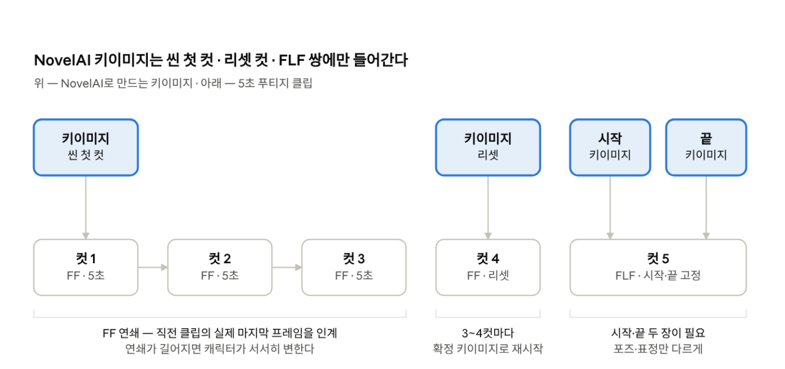
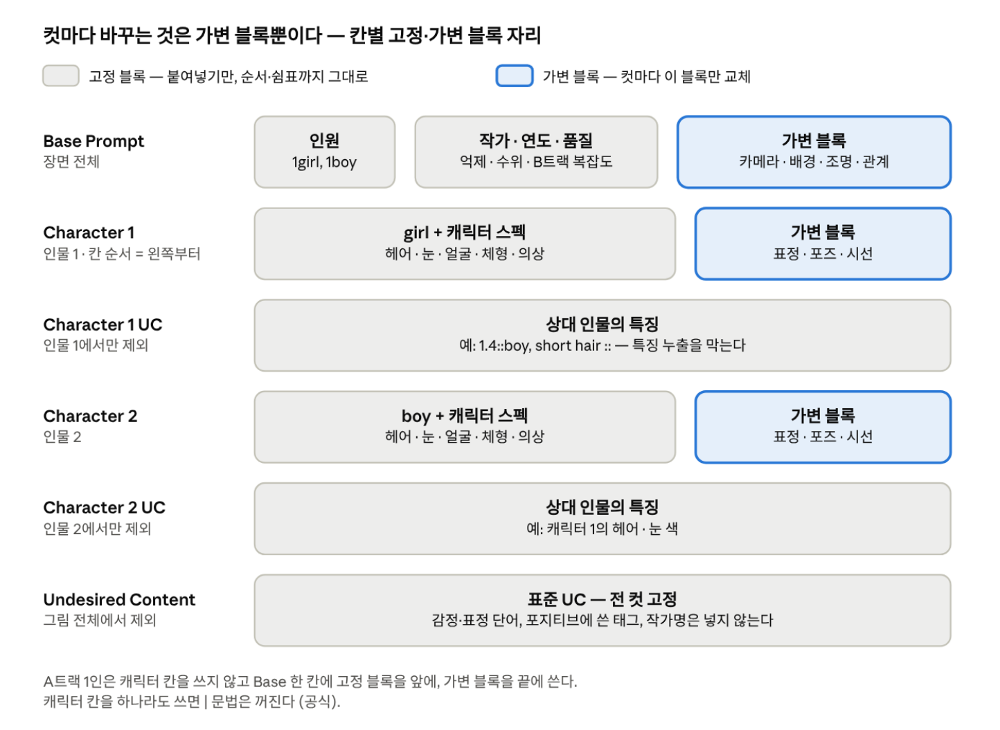

# 부산 스튜디오 NovelAI 키이미지 교재

Oct 2, 2026 · @정원

배정받은 컷의 키이미지를 기준대로 만드는 교재다. 설정을 맞추고, 캐릭터를 확정하고, 컷을 설계해 뽑고, 고치고, 스스로 판정하는 순서로 읽는다. 제공 자료 ⑥-A\~C(모델 트랙·인페인팅·배경 합성)와 ①(프롬프트 라이브러리)의 핵심을 한 권으로 묶었고, 일자별 진행은 「부산 스튜디오 교육 커리큘럼」 3\~5장을 따른다.

## 0. 이 교재를 쓰는 법

키이미지 작업은 이 교재의 순서대로 한다 — 2장 설정 → 4장 캐릭터 확정 → 6장 컷 설계 → 7\~8장 수정·합성 → 11장 판정. 결과가 이상하면 다른 자료를 뒤지기 전에 10장 문제 해결표부터 본다. NovelAI가 처음이면 이 장 바로 뒤의 길라잡이부터 따라 한다.

### 커리큘럼 일차와 교재 장

| 커리큘럼 일차 | 교재에서 볼 곳 | 그날 확인 |
| --- | --- | --- |
| 1일차 | 0장 · 길라잡이 · 2장 | 첫 30분 실습을 마치고 설정 점검표를 설명할 수 있다 |
| 2일차 | 2장 · 3장 | 설정 점검표 전 항목 일치 |
| 3\~4일차 | 4장 · 5장 · 6장(어휘) | 확인 과제 ① — 기준 이미지 3종 + 상황이 다른 12장 |
| 5\~6일차 | 7장 | 확인 과제 ② — 오류 6장을 부위당 3회 이내로 수정 |
| 7\~8일차 | 10장 · 11장 | 15항목 판정 일치율 12/15 이상 |
| 9일차 | 8장 · 6장(FLF 컷 규칙) | 확인 과제 ③ — 합성 3컷 + FLF 이미지 1쌍 |
| 10일차 | 9장 | 확인 과제 ④ — 새 씬 12장을 더 짧은 시간에 |
| 11\~15일차 | 6장(FF·FLF 규칙) | 푸티지에 넣었을 때 문제가 없는 키이미지 |

### 근거 표기

| 표기 | 뜻 | 다루는 법 |
| --- | --- | --- |
| (공식) | NovelAI 공식 문서·저널 | 그대로 따른다 |
| (본사) | 본사 편집팀 회신·하달 자료 | 우리 표준. 공식과 다르면 본사를 따른다 |
| (사내) | 부산 매뉴얼·가이드·실측 | 우리 표준. 버전과 날짜를 확인한다 |
| (현장 A · B · C) · (커뮤니티) | 아카라이브 AI그림 채널 등에서 실제로 작품을 만든 사람들의 보고. A는 같은 시드 비교나 여러 사람이 확인한 것, B는 숙련자 한 명의 경험, C는 일화다. (커뮤니티)는 커리큘럼 10장 판정(채택·검증 후 채택·참고)을 거친 현장 후기다 | 실전 기준으로 쓴다. A는 그대로, B는 우리 세트에서 한 번 확인하고, C는 막혔을 때 시도한다. 공식·본사·사내 값과 다르면 4-4 비교 후보로 올리고, 더 최신이고 신뢰할 수 있는 쪽을 임시값으로 쓴다 (10/1 결정). 작업자가 B·C 팁을 시도하는 것은 가변 블록과 UC 추가 안에서만이고, 생성 기록에 남긴다. 고정 블록·설정값은 부산만 바꾼다 |
| 임시값 · ⚠ | 운영계획서 4-4에서 아직 확정하지 않은 값, 또는 화면·실측으로 더 확인해야 하는 내용 | 확정되면 이 교재를 고친다. 그전까지는 적힌 임시값을 쓴다 |

### 본사 3원칙 — 이것만 지켜도 절반은 해결된다 (본사)

1. **눈은 고치는 게 아니라 처음부터 잘 뽑는다.** 잘 나오는 작가 조합을 찾는 데 하루를 쓰는 편이, 컷마다 눈 수정에 30분씩 쓰는 것보다 빠르다.
2. **같은 뜻의 태그는 하나만 쓴다.** 우리 팀의 눈 깨짐 사고는 '둥근 동공' 계열 태그 4개와 '정면 응시' 계열 5개가 겹친 것이 원인이었다.
3. **작가 태그 없이 시작하지 않는다.** 그림체를 붙잡을 기준이 없으면 부분 수정을 해도 그 부분만 화풍이 달라진다.

> **제작 준수 사항 — 품질보다 먼저 지킨다 (운영계획서 2-4)**
>
> - 모든 등장인물은 명백한 성인으로 설정하고 표현한다. 나이를 어리게 보이게 하는 태그·체형·복장·장소 등 미성년자로 인식될 여지가 있는 요소는 쓰지 않는다. 애매하면 작업을 멈추고 부산에 묻는다.
> - 실존 인물이나 특정인을 연상시키는 캐릭터를 만들지 않는다.
> - 배정서에 없는 기존 작품 캐릭터·작품 태그를 쓰지 않는다.
> - 생성물과 소스는 지정 저장소로만 옮긴다. 커뮤니티나 지정되지 않은 AI 서비스에 올리지 않는다.
>
> 이 항목에 걸리는 컷은 품질과 관계없이 1차 검수에서 반려된다 (운영계획서 6-1).

### 이 교재에 없는 것

- **작가 이름과 확정 조합** — 제공 자료 ③ 확정 태그 세트에 있다. 교재의 프롬프트 예시는 작가 자리를 `작가1` `작가2`로 비워 둔다.
- **실제 생성 이미지** — 보안 규칙상 이 문서에 넣지 않는다. 통과·반려 비교는 제공 자료 ⑤ 실패 사례집(사내 저장소)의 번호로 가리킨다.
- **푸티지 생성** — 운영계획서 5-2와 커리큘럼 5장에서 다룬다. 이 교재는 푸티지에 넣기 좋은 키이미지를 만드는 데까지다.

## 길라잡이 — NovelAI를 처음 여는 사람에게

NovelAI가 처음이면 첫 주에는 이 장부터 본다. 낯선 것은 영어 화면 용어와 '무료로 뽑는 조건' 두 가지다. 이 둘을 익히고 첫 30분 실습을 마치면 2장부터 순서대로 따라올 수 있다.

### 1분 요약 — 다섯 가지만 기억한다

1. **프롬프트는 영어 태그 목록이다.** 단어를 쉼표로 나열한다. 문장은 B트랙(V5)에서 위치·관계를 적을 때만 짧게 쓴다 (3장).
2. **무료 조건은 네 가지다** — 1장씩, 베이스 이미지 없이, Normal 크기 이하, Steps 28 이하 (공식). 생성 버튼의 Anlas 표시가 0이 아니면 조건을 벗어난 것이다. 단, V5는 사용 한도가 0%가 되면 조건 안에서도 Anlas가 든다 (3번).
3. **V5는 Opus여도 한도가 있다.** V4.5는 무료 조건 안에서 무제한이다. V5는 생성할 때마다 사용 한도가 줄고, 매분 조금씩 다시 찬다 (공식 9/15).
4. **좋은 그림은 바로 저장 아이콘으로 받는다.** 새로고침하거나 페이지를 닫으면 생성물이 사라진다. 받은 PNG를 화면에 끌어다 놓으면 프롬프트·설정·시드가 돌아온다 (공식).
5. **한 번에 하나만 바꾼다.** 두 가지를 함께 바꾸면 무엇이 효과였는지 모른다. 결과가 이상하면 10장 문제 해결표부터 본다.

### 화면 한 바퀴 — 용어 대응표

NovelAI 화면 언어는 영어·일본어 두 가지다 (공식). 이 교재는 영어 화면을 기준으로 적는다. '현장 말'은 아카라이브 AI그림 채널에서 흔히 쓰는 줄임말이다.

| 화면 표기 | 우리말 | 현장 말 | 하는 일 · 우리 기준 | 교재 |
| --- | --- | --- | --- | --- |
| Prompt | 프롬프트 | 프롬 | 그릴 것을 쉼표로 구분한 태그로 적는다 | 3장 |
| Undesired Content (UC) | 제외 프롬프트 | 네거 | 나오지 않게 할 것. 표준 UC를 붙여넣는다 | 3장 |
| Character Prompts · Position | 캐릭터 칸 · 위치 | — | 인물별 외형·표정·포즈와 화면 위치 | 3 · 5장 |
| Add Quality Tags | 품질 태그 자동 추가 | — | 끈다. 켜면 보이지 않는 태그가 프롬프트 끝에 붙는다 (공식) | 2 · 3장 |
| UC Preset | UC 프리셋 | — | None. 표준 UC를 직접 적는다 (본사) | 2 · 12장 |
| Steps | 스텝 | — | 그리는 단계 수. 28 이하만 무료 | 2장 |
| Prompt Guidance | 가이던스 | CFG | 프롬프트를 따르는 강도. 너무 높으면 역효과가 난다 (공식) | 2장 |
| Prompt Guidance Rescale · Noise Schedule · Variety+ | 고급 설정 | — | 트랙 표준값 그대로 둔다 | 2장 |
| Seed | 시드 | — | 같은 설정을 다시 낼 때 쓰는 번호. 같은 그림을 보증하지는 않는다 | 5장 |
| Sampler | 샘플러 | — | Euler Ancestral | 2장 |
| 크기 프리셋 · 너비 × 높이 | 해상도 | — | 트랙 해상도를 넣는다. Normal을 넘으면 Anlas가 든다 | 2장 |
| Number of Images | 생성 장수 | — | 1. 2장 이상이면 Opus여도 Anlas가 든다 (공식) | 2장 |
| Generate | 생성 버튼 | — | 이번 생성의 Anlas 비용이 표시된다. 0인지 보고 누른다 (커뮤니티 · 1일차에 화면으로 확인) | 2장 |
| Image2Image · Inpaint | 이미지 기반 생성 · 부분 수정 | 인페 | Image2Image는 Anlas가 들어 표준 수단에서 뺀다. Inpaint는 예외적인 보수 수단이다 | 7장 |
| Precise Reference | 정밀 레퍼런스 | 레퍼 | 기준 이미지로 얼굴·의상을 붙잡는다. V4.5 전용, 이미지당 +5 Anlas | 5장 |
| Vibe Transfer | 바이브 트랜스퍼 | — | 참조 이미지의 분위기를 가져온다. V5에는 아직 없다 | 8장 |
| Director Tools | 디렉터 툴 | — | Emotion · Declutter · Remove Background 등 후처리 | 5 · 7 · 8장 |
| Enhance · Upscale | 보강 · 확대 | — | 마감 도구. Upscale은 그림을 바꾸지 않는다 (공식) | 7장 |
| History | 히스토리 | — | 오른쪽의 생성 목록. 새로고침하면 사라진다 (공식) | 9장 |
| Anlas | 안라스 | 안라스 | 무료 조건 밖의 생성에 쓰는 포인트 | 2장 |
| Opus Usage Limit | V5 사용 한도 | 할당량 | V5 생성량 바. 햄버거 메뉴에서 상시 표시로 켠다 (공식) | 2장 |
| Prompt Chunks | 프롬프트 청크 | — | 고정 블록을 저장해 두고 프롬프트 칸에서 @를 쳐서 불러온다 (공식) | 3 · 9장 |
| Transparent BG | 투명 배경 | 누끼 | V5 화면 왼쪽 아래 체크. 켜면 배경 없이 처음부터 다시 그린다. 투명 배경 소재를 뽑을 때만 켜고 끝나면 끈다 (현장 A) | 8장 |

이 밖의 현장 말 — 작태(작가 태그), 누끼(배경을 뺀 캐릭터 이미지), 오퍼스(Opus 구독).

### 첫 30분 실습 — 1일차 환경 세팅 다음에

부산이 연습용으로 지정한 세트(제공 자료 ③) 하나로 한다. 좋은 그림을 뽑는 실습이 아니라, 화면이 어떻게 반응하는지 손에 익히는 실습이다.

1. **모델을 고른다** — 배정 트랙의 V4.5 Full 또는 V5 Full. 이름에 Curated가 붙은 모델이 아닌지 본다.
2. **설정을 맞춘다** — 2장 작업 전 점검표대로 맞춘다. 설정이 꼬이면 Reset으로 기본값을 되돌린 뒤 다시 맞춘다. 기본값은 우리 표준값과 다르다 (2장).
3. **프롬프트를 붙여넣는다** — 연습 세트의 고정 블록 뒤에 `upper body, straight-on, smile, looking at viewer, simple background`를 붙인다. B트랙은 3장 구조대로 Base와 Character 1 칸에 나눠 넣는다.
4. **UC를 붙여넣는다** — 3장 표준 UC를 그대로 넣는다.
5. **비용을 보고 생성한다** — Number of Images가 1이고 생성 버튼의 Anlas 표시가 0인지 확인한 뒤 누른다.
6. **저장한다** — 마음에 드는 한 장을 저장 아이콘으로 받는다.
7. **설정을 되살린다** — 받은 PNG를 화면에 끌어다 놓고 프롬프트·설정·시드가 돌아오는지 본다. 선택지가 뜨면 설정(메타데이터)을 가져오는 쪽을 고른다. Image2Image로 넣으면 베이스 이미지가 되어 Anlas가 든다.
8. **한 단어만 바꾼다** — 돌아온 시드를 그대로 두고 `smile`만 `serious`로 바꿔 뽑는다. 얼굴과 구도가 얼마나 남는지 본다 (5장 모드 A).
9. **강조를 써 본다** — `serious`를 `1.2::serious ::`로 바꿔 차이를 본다 (3장 문법 표준).
10. **비용이 붙는 순간을 본다** — Number of Images를 2로 바꾸면 Anlas 표시가 0에서 바뀐다. 누르지 말고 1로 되돌린다. B트랙은 한도 바가 생성할 때마다 조금씩 줄어드는 것도 본다.

다 마치면 2장 점검표의 각 항목이 왜 있는지 자기 말로 설명해 본다 — 1일차 확인 항목이다. 막힌 단계는 아래 표에서 먼저 찾는다.

### 처음 막히는 15가지

입문자가 가장 자주 막히는 지점을 공식 문서와 현장 보고(아카라이브)를 대조해 답했다. 표의 답이 이 교재의 기준이다.

| 막히는 곳 | 이렇게 이해한다 | 교재 |
| --- | --- | --- |
| Opus면 무제한 아닌가 | V4.5는 무료 조건 안에서 무제한이다. V5는 Opus도 사용 한도가 있고, 0%가 되면 구독 Anlas·유료 Anlas로 생성된다 (공식 9/15) | 2장 |
| Anlas가 언제 빠지나 | 무료 조건 네 가지 중 하나라도 벗어날 때다 — 2장 이상 동시 생성, 29스텝 이상, Normal 초과 크기, 베이스 이미지 사용(Image2Image 등). 인페인팅·도구는 버튼 표시로 확인한다 | 2장 |
| 구독 Anlas와 유료 Anlas | Opus는 매달 구독 Anlas 10,000을 받고 그것부터 쓴다. 구독 Anlas는 구독이 끝나면 0이 되고, 유료 Anlas는 남는다 (공식 Docs · 9/22 저널) | 2장 |
| 남의 그림이 똑같이 안 나온다 | 모델·크기·Steps·Guidance·Sampler·시드·UC·Quality Tags·생성 장수·Image2Image 참조까지 모두 같아야 하고, 그래도 100% 같지는 않다 (공식). 9월 GPU 이전 뒤에는 예전 시드도 달라졌다 (공식). 캐릭터 칸 구성이 달라도 결과가 바뀐다 (현장 B) | 5장 |
| 태그로 쓰나, 문장으로 쓰나 | V4.5는 태그만 쓴다. V5는 외형·화풍·시점은 태그로, 위치·관계·광원 방향만 짧은 영어 문장으로 쓴다. 한국어를 넣으면 한국 웹툰풍으로 끌려간다 (현장 B) | 3장 |
| 강조 문법이 여러 가지다 | `{}`는 한 겹에 1.05배, `[]`는 한 겹에 1/1.05배다 (공식). 우리는 숫자 문법 `1.2::태그 ::` 하나만 쓴다. 닫는 `::` 앞은 한 칸 띄운다 — 붙이면 숫자로 끝나는 작가명을 잘못 읽는다 (현장 A) | 3장 |
| UC는 많을수록 좋은가 | 아니다. 길면 그림이 밋밋해지고 표정·동작까지 막는다. 표준 UC에서 시작해, 3장 표의 상황에서만 더한다 | 3장 |
| 품질 태그가 겹친다 | Add Quality Tags가 켜져 있으면 보이지 않는 품질 태그가 끝에 또 붙는다 (공식). 끈다 | 2 · 3장 |
| 두 사람 특징이 섞인다 | 캐릭터 칸으로 나누고, 위치를 Custom으로 고정하고, 각 캐릭터 UC에 상대 특징을 적는다 | 5장 |
| 컷마다 다른 사람 같다 | 확정 세트와 고정 블록은 붙여넣기만 하고, 구도군 시드를 쓰고, 기준 이미지와 5초 대조한다 | 4 · 5장 |
| 인페인팅을 해도 안 바뀐다 | Strength를 0.5 이상으로 올린다. 프롬프트에 수정 대상·품질·작가 태그가 있는지 확인하고, 다른 요소가 끼어들면 그 셋만 남긴다 | 7장 |
| 뽑은 그림이 사라졌다 | 생성물은 서버에 남지 않는다 (공식). 채택 후보는 바로 저장 아이콘으로 받고, 정리할 때는 히스토리의 Download ZIP을 쓴다 | 9장 |
| V5에 레퍼런스를 넣었더니 그림체가 바뀌었다 | V5에는 Vibe Transfer·Precise Reference가 없다. 참고 이미지를 넣으면 모델이 V4.5로 자동으로 바뀐다는 보고가 있다 — 생성 전에 모델 이름을 본다 (현장 A) | 5장 |
| 배경이 투명하게 나온다 | 화면 왼쪽 아래 Transparent BG 체크가 켜져 있다. 투명 배경 소재를 뽑을 때만 켜고 끝나면 끈다 (현장 A) | 2 · 8장 |
| 재결제했는데 V5 한도가 100%로 안 찬다 | 100%가 상한이고, 재구독은 만료 때 잔량 + 공백 기간 충전량으로 시작한다(공식 9/15). 하루 충전량(첫 30일 약 11%, 그 뒤 약 14%)으로 계획한다 (현장 A — 공식 9/15 저널 번역 글) | 2장 |

### 마음가짐

- 첫 주의 목표는 좋은 그림이 아니라, 같은 그림을 다시 만들 수 있는 것이다.
- 이상한 결과는 실패가 아니라 단서다. 무엇을 바꿨는지 생성 기록에 남기면 원인이 보인다.
- 15분 넘게 막히면 커리큘럼 9장 질문 양식으로 묻고 다음 과제로 넘어간다.
- 현장 팁은 0장 근거 표기대로 쓴다 — A는 그대로, B는 우리 세트에서 한 번 확인하고, C는 막혔을 때 시도한다. 직접 시도하는 범위는 가변 블록과 UC 추가까지다.
- 개인 작업에서 쓰던 강조 문법·설정값은 사내 작업에 가져오지 않는다. 1일차에 '사내 기준과 다른 내 습관'을 적어 둔다 (커리큘럼).

## 1. 키이미지가 결과를 정한다

푸티지는 키이미지를 움직일 뿐이다. 키이미지의 흠은 5초 동안 커지고, FF 연쇄를 타고 다음 컷까지 번진다. 그래서 재작업의 대부분이 키이미지에서 생기고, 숙련 차이도 여기서 가장 크게 난다 — 운영계획서 2-2 추정으로 숙련 차이의 절반 이상이 ②캐릭터 확정과 ④키이미지 검수에서 나온다.



씬의 첫 컷과 리셋 컷에만 새 키이미지를 넣고, 나머지 FF 컷은 직전 클립의 마지막 프레임을 이어받는다. FLF 컷은 시작·끝 두 장이 필요하다.

### 좋은 키이미지의 7가지 조건

| # | 조건 | 왜 중요한가 | 판정 (운영계획서 6-1) |
| --- | --- | --- | --- |
| 1 | 기준 이미지와 같은 인물 | 5초 클립에서는 두 프레임 사이의 작은 차이가 움직임으로 커져 보인다 (사내) | 항목 8\~11 |
| 2 | 눈·손 무결 | 영상으로 만든 뒤에는 고칠 수 없고, 움직이면 더 눈에 띈다 | 항목 1\~7 |
| 3 | 씬 안에서 배경·조명 일관 | 컷마다 광원 방향이 바뀌면 편집에서 깜빡임처럼 보인다 (사내) | 합성 보조 ① (합성 컷) |
| 4 | 동작을 시작할 수 있는 자세 | 동작이 이미 끝난 자세나, 움직일 부위(손·팔·고개)가 화면 밖으로 잘린 구도는 원하는 동작을 만들기 어렵다 (사내 설계 기준 ⚠ 실측으로 보완) | 항목 12\~13 (푸티지 단계) |
| 5 | 규격 화면비·해상도 | 나중에 크롭하면 구도가 망가지고 캐릭터 크기가 컷마다 달라진다 (사내) | 항목 14 |
| 6 | 기록 | 트랙·세트·시드·고정 블록 버전이 없으면 재작업 때 같은 그림을 다시 못 만든다 | 항목 15 |
| 7 | 준수 사항 | 걸리면 품질과 관계없이 반려된다 | 선행 확인 |

### 키이미지가 필요한 자리 (사내)

- **FF 컷** — 씬의 첫 컷에만 NovelAI 키이미지가 필요하다. 다음 컷은 직전 클립의 실제 마지막 프레임을 인계한다.
- **리셋** — FF 연쇄가 길어지면 캐릭터가 서서히 변하므로 3\~4컷마다 확정 키이미지로 다시 시작한다.
- **FLF 컷** — 시작·끝 두 장이 필요하다. 두 장은 배경·조명·프레이밍·앵글이 같고 포즈·표정만 달라야 한다. 가장 까다로운 키이미지다.
- **생성량** — 채택률을 감안하면 컷 하나에 실제 생성은 몇 배가 된다. V5(B트랙)로 탐색하면 사용 한도가 빨리 줄기 때문에, 구도 탐색은 트랙 규칙(2장)에 맞춰 한다.

## 2. 작업 환경과 기준 설정

설정은 매번 고민하는 것이 아니라 표대로 맞춰 두는 것이다. 트랙(A·B)은 배정서가 정하고, 작업자는 그 트랙의 표준값을 그대로 쓴다.

### 계정과 화면 준비 — 1일차에 한 번

- **저장** — 저장 형식을 PNG로 두고, 채택 후보는 저장 아이콘으로 즉시 받는다. 생성물은 서버에 남지 않고 새로고침하거나 페이지를 닫으면 사라진다 (공식). 우클릭 저장·클립보드 복사는 프롬프트·시드·설정이 빠진다. 히스토리 전체는 Download ZIP으로도 받을 수 있다 (공식).
- **한도 바** — 햄버거 메뉴의 Opus Usage Limit을 상시 표시로 켜 둔다 (공식).
- **자동 태그 끄기** — Add Quality Tags는 끄고, UC Preset은 None으로 둔다. 품질 태그와 UC는 직접 적는다 (본사). 켜 두면 우리가 적지 않은 태그가 함께 들어간다 (공식 — 3·12장).
- **계정** — 작업자별 계정만 쓴다. 공용 계정·계정 공유는 금지다 (운영계획서 2-4). 9월 공식 공지는 일부 계정의 결제 제한(Payment Restrictions)에 관한 것이었고, 계정 공유·리셀러 구매가 위험 요인으로 거론됐다 (공식 공지 제목 · 현장 A — 원문 확인 ⚠).

### 트랙별 기준 설정

| 항목 | A트랙 · V4.5 Full | B트랙 · V5 Full | 근거 |
| --- | --- | --- | --- |
| 쓰는 곳 | 씬별 양산, 같은 캐릭터 다각도 변주 | 마스터 컷, 다인원, 복잡한 배경, 투명 배경 소재 | (사내) |
| Steps | 25 | 임시 23 — V5 기본값이자 공식 한도 수치의 기준이고, 현장도 23 이하로 모인다(현장 A). 이전 사내값 28은 4-4 비교 후보 ⚠ | (본사) (공식) (현장) |
| Guidance | 5 | **임시 5** — 공식 권장 5\~6, 현장 단일 일러 4\~5.5(현장 B). 4·5·6을 같은 시드로 비교해 확정한다 ⚠. 이전 사내값 7은 배정서나 부산이 지정한 컷(만화 컷처럼 지시를 강하게 따라야 할 때)에만 쓴다 | (본사) (공식) (현장) |
| Sampler | Euler Ancestral | Euler Ancestral | (본사) (사내) |
| Guidance Rescale · Noise Schedule | 기본값 유지 — 사내 리포트의 0.1 · karras는 4-4에서 비교 ⚠ | 기본값 유지 — V5 화면에서는 노이즈 스케줄을 고를 수 없다(현장 B) | (사내) |
| Variety+ | 끔 — 4-4에서 비교 ⚠ | 끔 — 4-4에서 비교 ⚠ | (공식 2024) (사내 임시) |
| 해상도 | 1024×704 | 1216×832 | (본사) (사내) — 4-4에서 하나로 ⚠ |
| Add Quality Tags · UC Preset | 끔 · None | 끔 · None | (본사) |
| 복잡도 태그 | 없음 | `high complexity` 기준, 세트별 확정. 조금 더 올릴 땐 1.1\~1.2::high complexity ::, 단순화·배경 잡동사니 제거는 low (현장 A) | (공식) (현장) |
| Seed | 탐색은 랜덤, 채택하면 기록 | 구도군 전용 시드 (5장) | (사내) |
| Precise Reference | Character · Strength 1 · Fidelity 1, 필요할 때만 | 없음 — V4.5 전용 | (본사) (공식) |

8/18 매뉴얼의 범위값(Steps 25\~28, Guidance 5\~6)은 본사 회신값(25 · 5)으로 통일한다. 공식 문서는 V3 이상에 Guidance 5\~6을 권하고, 너무 높으면 역효과가 날 수 있다고 안내한다 — 색이 과하게 진해지는 예는 V3 기준 설명이다 (공식). Variety+는 생성 초반에는 가이던스를 걸지 않고 후반에 걸어 구도를 다양하게 하는 옵션이다 (공식 2024 블로그 — V3 때 소개). 켜고 끄면 같은 시드도 다른 그림이 되므로 끔으로 통일한다. 화면에 이 토글이 없으면 건너뛴다 ⚠ V4.5 현장도 Guidance 4.5\~5.5에 모이고(현장 B), 4→5 변화는 크며 5→6은 작다(현장 A). B트랙 임시값(Steps 23 · Guidance 5)은 공식 한도 계산의 기준 스텝(23)·V3 이상 공통 권장 Guidance(5\~6)와 9월 현장 보고가 같은 방향인 쪽으로 10월 1일에 바꿨다 — 이전 사내값(28 · 7)은 4-4 비교 후보로 남긴다.

> **해상도는 16:9를 기준으로 정한다 (4-4 결정 대기)**
>
> 납품은 16:9(1920×1080)다. 1024×704와 1216×832는 약 3:2라 16:9로 자르면 위아래가 약 18% 잘린다. 부산은 무료 조건(픽셀 수 1024×1024 이하)과 본사 툴 입력 조건(16의 배수 · 긴 변 1280)을 함께 보고 한 가지로 정한다. 16:9에 가까운 후보로 1344×768(1,032,192픽셀 — 1024×1024 이하라 공식 무료 조건 안. 단 7:4라 정확한 16:9는 아니다)이 있다 ⚠ 무료 판정과 본사 툴 입력은 확인이 필요하다. V5에서 크기를 직접 입력했더니 장당 35 Anlas가 들고 Normal로 바꾸자 0이 됐다는 후기가 있다(9/26, 크기 미기재 · 커뮤니티 · 참고). 후보 크기는 생성 버튼의 Anlas 표시가 0인지부터 본다.
>
> 확정 전까지는 위 표의 트랙별 값을 쓰고, 프레이밍은 위아래 18%가 잘려도 괜찮게 여유를 둔다.

### 비용 조건 (Opus)

| 구분 | 내용 | 근거 |
| --- | --- | --- |
| 무료 조건 | ① 1장씩 ② 베이스 이미지 없음 ③ Normal 크기 이하(픽셀 수 1024×1024 이하) ④ Steps 28 이하 | (공식) |
| V4.5 이하 | 무료 조건 안에서 무제한. 사용 한도는 V5에만 적용된다 | (공식 9/15) |
| V5 사용 한도 | 무료 조건 안의 생성도 한도에서 차감된다. 0%가 되면 구독 Anlas·유료 Anlas로 계속 생성하며, Anlas 생성은 최우선으로 처리된다 | (공식 9/15) |
| 한도 크기 | 100% ≈ 1,730장, 1%당 약 17장, 월 약 7,000장 (23스텝 · 약 100만 픽셀). 28스텝이면 눈에 띄게 적다 | (공식 9/15) |
| 충전 | 매분 계속 찬다. 구독 첫 30일은 하루 약 11%(완충 9일), 그 뒤는 하루 약 14%(완충 7일). 100%가 상한이라 쓰지 않으면 넘친 만큼 사라지고, 재구독하면 만료 때 남은 양에 공백 기간 동안 찬 양을 더해 시작한다(상한 100%, 공식 9/15) (현장 A — 공식 9/15 저널 번역 글) | (공식 9/15) |
| 절약 | 해상도를 낮추는 쪽이 스텝을 낮추는 것보다 효과가 크다 — 태그·프롬프트 탐색은 작은 크기로 한다. 해상도를 바꾸면 같은 시드도 다른 그림이 되므로 구도와 시드는 기준 해상도에서 정한다 (9장) | (공식) |
| 구독 Anlas | Opus는 매달 10,000을 받고, 구독 Anlas를 먼저 쓴 뒤 유료 Anlas를 쓴다. 구독이 끝나는 순간 0이 된다. 조기 해지하면 원래 종료일에 0이 된다. 유료 Anlas는 소멸하지 않는다 | (공식 Docs · 9/22 저널) |
| 추가 비용 | Precise Reference는 레퍼런스 한 장마다 이미지당 +5 Anlas. Vibe Transfer는 인코딩 1회 2 Anlas(Information Extracted를 바꾸면 다시 든다), 4장을 넘는 바이브는 1장마다 생성당 +2 Anlas. 여러 장 동시 생성은 Opus여도 항상 Anlas가 든다. 29스텝 이상, Normal 초과, Image2Image도 Anlas가 든다 | (공식) |
| 비용표 없음 | 인페인팅 · Director Tools · Enhance · Upscale은 공식 비용표가 없다. 쓰기 전에 버튼의 Anlas 표시를 본다. Opus는 Focused Inpainting으로 큰 이미지의 일부를 0 Anlas로 고칠 수 있다. Upscale은 2023년 공식 블로그 기준 640×640 이하 이미지만 Opus 0 Anlas였다 — 지금도 같은지는 버튼 표시로 확인한다 | (공식) |

하루 14%는 23스텝 기준 약 240장이다 (계산값). B트랙은 이 범위에서 컷 수를 나눠 잡고, 계정마다 하루 실제 생성 장수를 기록해 맞춘다.

### 작업 전 점검표

- [ ] 배정서의 트랙(A·B)과 확정 태그 세트 번호를 확인했다
- [ ] 모델이 V4.5 Full 또는 V5 Full이다 (Curated가 아니다)
- [ ] Steps · Guidance · Sampler · 해상도가 트랙 표준값이다
- [ ] Add Quality Tags를 끄고 UC Preset을 None으로 두었다
- [ ] 표준 UC를 붙여넣었다 (3장)
- [ ] 한 번에 1장씩 생성하도록 두었고, 생성 버튼의 Anlas 표시가 0이다
- [ ] 저장 형식 PNG, 저장 아이콘으로 받는다
- [ ] (B트랙) 사용 한도 바를 확인했고, 왼쪽 아래 Transparent BG 체크는 꺼 두었다 — 투명 배경 소재를 뽑을 때만 켠다
- [ ] 작가 태그가 들어 있다 — 없으면 시작하지 않는다

### 현장 팁 — 설정·비용 (아카라이브)

근거 A는 같은 시드 비교나 여러 사용자가 확인한 것, B는 숙련자 한 명의 경험, C는 일화다. 우리 기준과 다르면 더 최신이고 신뢰할 수 있는 쪽을 임시값으로 쓰고, 다른 쪽은 4-4 비교 후보로 올린다 (10/1 결정).

| 현장 팁 | 근거 | 출처 |
| --- | --- | --- |
| V5 Steps는 14\~23에 모인다. 공식 한도 수치도 23스텝 기준이고 23을 넘겨도 이득이 작다. 20 미만은 아직 품질이 떨어진다는 보고도 있다 | A | [183259759](https://arca.live/b/aiart/183259759) · [180645599](https://arca.live/b/aiart/180645599) |
| V5 Guidance는 단일 일러 4\~5.5(4에서 시작), 만화 3컷 이상·강한 지시는 6.5\~7. 7로 올리면 그림체가 더 고정되지만 과적합 위험이 있다 | B | [180645599](https://arca.live/b/aiart/180645599) · [182772209](https://arca.live/b/aiart/182772209) |
| V4.5 Guidance는 4.5\~5.5. 4→5 변화는 크고 5→6은 작다. UC·품질 태그·Guidance를 과하게 쓰지 않을수록 덜 망가진다 | A·B | [156089062](https://arca.live/b/aiart/156089062) · [144222087](https://arca.live/b/aiart/144222087) |
| Guidance Rescale(0\~0.5)은 채도를 낮추고 과포화를 누른다. 그림체가 튀면 Guidance를 올리고 Rescale을 내려 본다 | B | [184370635](https://arca.live/b/aiart/184370635) |
| V5 샘플러 성격 — Euler Ancestral 기준. DPM++ 2M SDE는 프롬프트를 더 강하게, DPM++ 2M은 디테일·붓질, DPM++ SDE는 채도가 낮고 구도가 다양하다 | B | [183527798](https://arca.live/b/aiart/183527798) |
| V5 화면에서는 노이즈 스케줄을 고를 수 없다. 실제 값은 novelai.net/inspect의 Raw Parameters에서 본다 | B | [180981614](https://arca.live/b/aiart/180981614) |
| Variety+는 다양성을 올리는 대신 프롬프트를 조금 덜 따른다 — 대량 탐색용 | C | [169942588](https://arca.live/b/aiart/169942588) |
| V5 한도는 월 400% — 첫 달은 100%를 먼저 주고 하루 약 11%, 다음 달부터 약 14%. 100%가 상한이라 안 쓰면 넘친 만큼 사라지고, 재구독하면 만료 때 남은 양에 공백 기간 동안 찬 양을 더해 시작한다(상한 100%, 공식 9/15) | A | [183132947](https://arca.live/b/aiart/183132947) (공식 9/15 저널 번역 글) |
| 한도 소모는 스텝·해상도에 비례하고 프롬프트 길이와는 무관하다. 정사각형이 조금 더 든다 | B | [182687351](https://arca.live/b/aiart/182687351) |
| 할당량이 남았는데 Anlas가 빠지면 ① Large 크기 ② 한 번에 2장 ③ 모델을 바꾸며 달라진 설정을 본다 | A | [181002215](https://arca.live/b/aiart/181002215) |
| 할당량을 다 쓰면 V5는 Normal 1장 약 30 Anlas, Large 약 38\~41 Anlas가 든다 — V4.5보다 비싸다 | B | [181285242](https://arca.live/b/aiart/181285242) |
| V4.5도 짧은 기간에 약 1,350장을 넘기면 공지 없는 제한이 걸리고, 시간당 약 60\~70장씩 다시 풀린다는 보고 — 공식 수치는 없다. 하루 생성량을 나눠 쓴다 | B | [182892372](https://arca.live/b/aiart/182892372) |

## 3. 프롬프트의 구조

프롬프트는 칸마다 넣을 것이 정해져 있고, 컷마다 바꾸는 것은 가변 블록뿐이다. 고정 블록을 건드리지 않는 것이 일관성의 절반이다. 아래 조립 순서는 사내 자료 4종(8/17 라이브러리 · 8/18 매뉴얼 · 8/30 V5 매뉴얼 · 9/9 V5 가이드)이 제각각이던 것을 트랙마다 하나로 묶은 초안이다. 10월 1일에 순서를 '인원 → 작가 → 연도·품질 → 억제 → 수위 → 외형 → 가변'으로 바꿨다 — 공식 문서가 권하는 서두(인원 먼저)와 V5 현장에서 공유되는 순서가 같은 방향이다. 4-4에서 확정한다 ⚠.



고정 블록은 텍스트 파일이나 Prompt Chunks에서 통째로 붙여넣고, 컷마다 바꾸는 것은 색이 들어간 가변 블록뿐이다. 트랙별 순서는 아래 초안을 따른다.

### 칸의 역할 (공식)

| 칸 | 넣는 것 | 넣지 않는 것 |
| --- | --- | --- |
| Base Prompt | 전체 인원수(`1girl`, `1girl, 1boy`), 작가·연도·품질 세트, 수위 태그, 구도·앵글, 배경·조명 | 캐릭터 칸을 쓸 때는 특정 인물의 머리색·눈색·의상 |
| Character n | `girl` / `boy` / `other` + 그 인물의 헤어·눈·얼굴·체형·의상·표정·포즈 | 숫자 붙은 인원수 태그(`1girl`) |
| Character n UC | 옆 인물의 특징 — 특징 누출을 막는 칸 | 비워 두기 (아래 표준 UC 참조) |
| Undesired Content | 표준 UC | 감정·표정 단어, 포지티브에 쓴 태그, 작가명 |

캐릭터 박스를 하나라도 쓰면 `|` 문법은 꺼진다. 두 방식은 섞을 수 없다 (공식). 프롬프트 길이에도 한도가 있다 — V4.5는 모든 칸을 합쳐 약 512토큰, V5 Full은 약 1,471토큰이고, Add Quality Tags가 붙이는 태그도 이 한도에 들어간다 (공식).

### 트랙별 조립 순서 — 초안

**A트랙 · V4.5 · 1인** — Base 한 칸에 쓴다. 인물이 한 명이면 캐릭터 칸을 쓰지 않는다 (사내 8/18).

```text
[고정] 1girl, solo,
[고정] 작가1, 작가2, year 20XX, best quality, masterpiece, -6::artist collaboration ::, 수위 태그,
[고정] 헤어, 눈, 얼굴 특징, 체형, 의상,
[가변] 프레이밍, 앵글,
[가변] 표정, 포즈·동작, 시선,
[가변] 배경, 시간대·조명
```

**A트랙 · V4.5 · 2인** — 캐릭터 칸을 쓴다. 칸 순서가 화면의 왼쪽→오른쪽이다 (공식).

```text
Base           [고정] 1girl, 1boy, 작가 세트 · 연도 · 품질 · 억제 · 수위,
               [가변] 프레이밍 · 앵글, 관계(side-by-side 등), 배경 · 조명
Character 1    [고정] girl, 캐릭터 스펙    [가변] 표정 · 포즈 · 시선
Character 1 UC  상대 특징 (예: 1.4::boy, short hair ::)
Character 2    [고정] boy, 캐릭터 스펙     [가변] 표정 · 포즈 · 시선
Character 2 UC  상대 특징
```

**B트랙 · V5** — 캐릭터 칸을 항상 쓴다. Prompt Desk NAI V5 모드와 같은 구조다 (사내 9/9). 혼자 나오는 컷은 외형을 Base에 합쳐야 재현이 잘 된다는 보고가 있어 4-4에서 비교한다 (현장 B) ⚠

```text
Base           [고정] 인원(1girl 등), 작가 세트(7~12명) · 연도 · 품질 1~2개 · high complexity · 억제 · 수위
               [가변] 카메라 블록(프레이밍 · 앵글)   [가변] 배경 · 조명
Character 1    [고정] girl, 캐릭터 스펙 1~6요소   [가변] 표정 · 포즈 · 시선
```

공식 문서가 권하는 서두는 `1boy, 1girl, characters, series` 다음 나머지 순서다. 데이터셋 태그(`background dataset` 등)는 Base 맨 앞에 둔다 (공식). 앞에 올수록 강하다는 규칙은 공식이 V3 이하에만 명시했다 — V4.5·V5에서는 경험칙으로만 쓴다. V5 현장에서 많이 공유되는 순서도 인원 → 작가 → 연도·품질 → 억제 → 수위 → 시점·구도 → 배경이다 (현장 B). V4.5에는 구도를 맨 앞에 두거나, 캐릭터 칸에서 행동을 외형보다 앞에 두는 변형도 있다 (현장 B) — 비교 후보일 뿐 기준은 아니다. 순서를 바꾸면 같은 시드도 결과가 달라지므로 트랙 안에서는 하나로 고정한다.

### 고정 블록과 가변 블록 (사내)

| 블록 | 무엇 | 규칙 |
| --- | --- | --- |
| 고정 | 인원 · 작가·연도·품질 세트·억제 · 수위 · 캐릭터 스펙 | 텍스트 파일이나 Prompt Chunks에서 통째로 붙여넣는다. 순서·쉼표·공백까지 그대로 둔다. 고치면 그 뒤의 컷을 다시 뽑는다 |
| 가변 | 프레이밍·앵글·포즈·표정·시선·배경·조명·소품 | 이 블록만 교체한다. 같은 개념은 늘 같은 단어로 쓴다 — 한 컷에서만 조명을 다른 말로 쓰면 화풍이 흔들린다 |

한 글자도 고치지 않는 이유 — 앞부분 문자열이 바뀌면 뒤쪽 토큰 위치가 밀려, 같은 시드여도 결과가 크게 달라진다 (사내 9/9). 오타 하나가 캐릭터를 바꾼다.

### 문법 표준 — 한 가지만 쓴다

| 하는 일 | 형태 | 쓰는 법 |
| --- | --- | --- |
| 강조 · 약화 | `1.2::태그 ::` · `0.7::태그 ::` | 1.1\~1.5 강조, 0.5\~0.9 약화. 숫자 없는 `::`가 구간을 닫는다. 1.0은 효과가 없다 (공식). UC 칸에서 강조하면 '더 강하게 피하라'는 뜻이 된다 (공식) |
| 제거 · 반전 | `-1::태그 ::` | V4.5 이상. 특정 대상을 없애거나 개념을 뒤집는다. 예: 흰 여백 탈출 `-1::simple background ::` (공식) |
| 작가 합작 억제 | `-6::artist collaboration ::` A트랙 · `-1.2::artist collaboration ::` B트랙 | 작가가 2명 이상이면 반드시 함께 넣는다. 빠지면 화면이 갈라지거나 시트처럼 나온다 (사내). 값은 트랙마다 다르다 — A트랙은 본사 세트의 -6, B트랙은 -1\~-2다(사내 8/30 -1.2). V5에서 -4\~-6을 쓰면 그림체가 출렁인다는 보고가 있다 (현장 A). 확정 태그 세트에 적힌 값을 쓴다 ⚠ |
| 태그 표기 | 소문자, 쉼표+공백, 밑줄 대신 띄어쓰기 | NovelAI 자동완성과 같은 표기다 (사내 표준). V4 이상은 대소문자를 구분한다고 보고 소문자로 통일한다 (사내 표준). 숫자 가중치는 닫는 `::` 앞을 한 칸 띄운다 — `1.5::rain, night ::`. 붙여 쓰면 숫자로 끝나는 태그·작가명을 잘못 읽는다 (현장 A) |
| 쓰지 않는 것 | `{태그}` 중괄호 · SD식 `(태그:1.2)` · 한 태그에 문법 섞기 | 문법 3중 혼용이 눈 깨짐의 원인이었다 (본사). 9/9 가이드의 중괄호 예시는 숫자 문법으로 바꿔 쓴다. Prompt Desk 배경 프리셋의 중괄호는 설정 탭에서 숫자 강조를 고르면 숫자 문법으로 나간다 (9장). 남의 프롬프트를 읽을 때는 중괄호 한 겹을 1.05배, 대괄호 한 겹을 1/1.05배로 본다 (공식) — 중괄호 두 겹이 약 1.1배다 |

### 작가 · 연도 · 품질 · 수위 블록

- **작가** — 트랙마다 다르다. A트랙(V4.5)은 본사 세트대로 2\~3명이다 (본사). B트랙(V5)은 7\~12명을 0.25\~0.9 정도의 낮은 가중치로 섞는 것을 임시 기준으로 한다 — 현장에서 공유되는 V5 조합이 대체로 이 형태다 (현장 B). 주력 작가도 1.0 안팎을 넘기지 않고, 조정은 0.05\~0.1 단위로 한다. 2 이상이면 특징만 남아 기괴해진다 (현장 A). 사내 8/30 매뉴얼의 '4명 이상이면 평균 그림체로 수렴한다'와 다르므로 4-4에서 같은 시드로 비교한다 ⚠. 작가명은 UC에 넣지 않는다 (현장 B). 태그를 칠 때 자동완성 목록에 뜨는 동그라미가 흐릴수록 모델이 그 태그를 잘 모른다 (공식). 동그라미가 흐린 작가는 가중치를 올려도 잘 안 나온다 (사내 8/30).
- **연도** — `year 2020` 형식. 어떤 연도든 동작하지만 결과는 편차가 있다 (공식). 최신이 항상 좋지는 않다 — 연도도 조합 찾기의 일부다 (본사). B트랙(V5)에서는 year 2026을 쓰지 않는다 — 워터마크가 끼고 그림체가 흔들린다는 보고가 많다. year 2025 하나, 2024와 2025를 함께, 또는 연도 없이 중에서 고른다 (현장 A).
- **품질** — 공식 목록은 `best quality` → `worst quality` 순의 품질 태그와 `masterpiece`(V4.5 이상) · `very aesthetic` 등 미학 태그다 (공식). 본사는 `best quality, masterpiece` + 연도 1개 + 작가 3명으로 짧게 쓴다 (본사). 현장도 품질 태그는 1\~2개만 쓴다 — 최상위 하나를 고르고, best quality와 amazing quality처럼 같은 역할의 태그를 겹치지 않는다. 짧은 프롬프트에 품질 태그가 많으면 배경을 과하게 채운다 (현장 A).
- **수위** — 수위 태그(`rating:explicit` 같은 등급 태그)도 그림체와 품질을 바꾸는 변수다. 같은 씬의 SFW·NSFW 컷은 수위 태그만 바꾸고 나머지 고정 블록은 그대로 둔 채 같은 시드로 비교한다 (현장 B). 인물은 모두 명백한 성인으로 쓴다 (운영계획서 2-4).
- **Add Quality Tags를 끄는 이유** — 켜면 화면에 보이지 않는 태그가 프롬프트 끝에 붙는다. V4.5 Full은 `, location, very aesthetic, masterpiece, no text`, V5 Full은 Standard `, very aesthetic, masterpiece, no text` · Light `, very aesthetic, amazing quality, no text`이고, 이 태그도 길이 한도를 차지한다 (공식). 우리 품질 블록의 `masterpiece`와 겹치고, 배경 통제가 어렵고 작가 개성이 눌린다 (사내).

### 표준 UC — 본사 기반 (사내 8/18)

```text
lowres, bad anatomy, worst quality, low quality, blurry, text, watermark, signature, monochrome, bad hands, extra digits, missing digits, multiple views, character sheet
```

| 상황 | 더하는 것 | 근거 |
| --- | --- | --- |
| 손가락 오류가 같은 인물에서 반복 | 그 캐릭터 UC에도 `bad hands, extra digits, fewer digits` | 캐릭터 UC를 비워 두었다가 넣어서 해결했다는 후기 (커뮤니티 · 검증 후 채택) |
| 양쪽 눈 색이 다르게 나옴 | `heterochromia` | (사내 8/30) |
| 실사 쪽으로 끌려감 | `realistic, photorealistic, 3d` | (사내 8/30) |
| 조연이 인형처럼 나옴 | `mascot, puppet, character doll` | (사내 8/17) |
| 배경이 필요 없는 컷에 배경이 자꾸 나옴 | `1.5::location ::` | (사내 8/30) |
| V4.5에서 쓰던 그림체가 V5에서 살아나지 않음 | `official art, official style` | V4.5 느낌이 돌아온다는 보고 (현장 B) · [180846611](https://arca.live/b/aiart/180846611) |
| 반쯤 감긴 눈이 끼어듦 | `half-closed eyes` | (현장 B) · [184344241](https://arca.live/b/aiart/184344241) |
| V5에서 머리가 작게 나옴 | `small head, bad proportions` | (현장 B) · [180827467](https://arca.live/b/aiart/180827467) |
| V5에서 눈이 깨짐 | `lazy eye, spiral-only eyes` + 작가 가중치를 낮춘다 | 작성자가 개선을 확인 (현장 B) · [180827467](https://arca.live/b/aiart/180827467) |
| AI 특유의 번들거림이 보임 | `ai-generated` | (현장 C) · [184026936](https://arca.live/b/aiart/184026936) |
| 색이 깨지거나 종이 질감이 생김 | `flat colors` — 색이 빠지면 포지티브에 `vivid color` | flat color 계열은 작가 태그를 덮어쓸 수 있다 (현장 C) · [184026936](https://arca.live/b/aiart/184026936) |

- **감정·표정 단어를 넣지 않는다.** 프롬프트로 표정을 요구하면서 UC로 막는 사고가 잦다 (사내).
- **포지티브와 같은 태그를 넣지 않는다.** 서로 상쇄된다 (사내).
- **남의 UC를 통째로 복사하지 않는다.** 모르는 단어가 내 요구를 막는다 (사내).
- **길게 쓰지 않는다.** 너무 많이 넣으면 그릴 것이 없어져 밋밋해진다 (사내 8/30). 현장도 UC 프리셋을 None(또는 Heavy)으로 두고 시작해 반복되는 문제만 하나씩 더한다. 너무 세게 빼면 오히려 그 요소를 더 의식하고, 색에 거는 음수 가중치는 -0.5 단위로 다룬다 — -1이면 색이 무너진다 (현장 B).

표준 UC의 `low quality` · `missing digits` · `character sheet` · `text`는 단부루·공식 목록 밖의 표기다. 본사 UC를 바탕으로 한 것이라 임의로 바꾸지 않고, 4-4에서 대체 표기(`bad quality` · `fewer digits` · `reference sheet`)와 같은 시드로 비교해 정한다 ⚠ (12장). 비교용 공식 UC 프리셋 원문은 12장에 실었다.

### V5에서 태그와 문장 나누기 (B트랙)

| 대상 | 쓰는 방식 |
| --- | --- |
| 캐릭터 외형 · 화풍 · 인원 · 의상 · 시점 | 태그 — 재현성이 생명이다 |
| 누가 무엇을 잡는지 · 좌우 · 앞뒤 · 상호작용 · 광원 방향 | 짧은 영어 문장 (커뮤니티 · 채택) |

V5 공식 지원 언어는 영어·일본어다. 한국어 문장은 쓰지 않는다 — 한국어를 넣으면 한국 웹툰풍으로 끌려간다는 보고가 있다 (현장 B). V4.5에는 한글·일본어·이모지 같은 비영문 문자를 넣지 않는다 (공식). 문장은 짧게 쓴다 — 길어지면 세부 지시가 빠진다. 프롬프트가 길면 STYLE · LIGHTING · CHARACTER · POSE · BACKGROUND처럼 블록으로 나눠 쓰기도 한다 (현장 B) — 나눠 쓰더라도 순서는 위 조립 순서를 따른다. 가중치 기호 :: 와 괄호도 토큰을 쓰지만, 캐릭터 외형은 상·하의 색까지 빠짐없이 쓴다 — 빠뜨리면 인물이 섞이거나 바뀐다 (현장 B).

### 현장 팁 — 프롬프트 (아카라이브)

본문에 녹이지 않은 프롬프트 팁이다. 근거 A·B·C는 2장 현장 팁과 같은 기준이다.

| 현장 팁 | 근거 | 출처 |
| --- | --- | --- |
| 중복(`red hair` + `scarlet hair`)·충돌(`standing` + `sitting`)·동음이의(`bat`) 태그를 지운다. 순서가 곧 중요도다. 태그가 실제로 있는지는 단부루에서 확인한다 | B | [184036161](https://arca.live/b/aiart/184036161) |
| 태그가 안 먹으면 단부루 태그 페이지의 Aliases에서 이름이 바뀌기 전 표기로 써 본다 (V4.5) | B | [174433645](https://arca.live/b/aiart/174433645) |
| 숫자로 끝나는 작가명·태그만 앞도 띄워 `1.2:: 작가명 ::`처럼 쓰고, 그 밖에는 표준 `1.2::태그 ::`로 쓴다. 문장 뒤에서 가중치를 닫을 때는 `. ::`처럼 띄운다 | A | [181418568](https://arca.live/b/aiart/181418568) · [183324570](https://arca.live/b/aiart/183324570) |
| 품질 등급 태그는 최상위 하나만 쓰고 겹치지 않는다. 미학 태그는 함께 써도 된다 — `masterpiece`는 V4.5부터 쓰는 태그다 | A | [137309508](https://arca.live/b/aiart/137309508) |
| V4.5 변형 순서 — Base는 구도→작가→메타→연도→화풍→품질, 캐릭터 칸은 기본 정보→체형→행동→머리→얼굴→상체→하체→디테일. 행동을 앞에 두면 인체가 자연스럽다는 댓글이 있다. 우리 기준과 달라 비교 후보로만 둔다 | B | [154848608](https://arca.live/b/aiart/154848608) |
| V5는 `::`와 괄호도 토큰을 쓴다(긍정 약 1,471토큰). 그래도 캐릭터 외형은 줄이지 않는다 | B | [180839752](https://arca.live/b/aiart/180839752) |
| 숙련자 커스텀 UC 예 — `text, signature, watermark, realistic, 3d, chibi, bad anatomy, wrong hand, bad hands, missing limb, extra digits, fewer digits, bad proportions, jpeg artifacts, artist collaboration, low quality, worst quality, displeasing`. 표준 UC와 비교할 때 참고한다 (V4.5) | B | [144222087](https://arca.live/b/aiart/144222087) |
| 모자이크·검열 표시가 생기면 UC에 `censored`를 넣는다 (V4.5 댓글) | C | [138220806](https://arca.live/b/aiart/138220806) |
| UC와 음수 가중치로 인체 오류가 크게 준다는 주장 — Guidance를 높이는 쪽이 더 안정적이라는 반론과 맞선다 (V4.5) | C | [138594143](https://arca.live/b/aiart/138594143) |

## 4. 캐릭터 확정

캐릭터 확정이 키이미지 작업의 절반이다. 순서는 본사 방식 그대로 — 캐릭터 태그 확정 → 작가 세트 확정 → 기준 이미지 3종 → 본제작. 이 순서를 건너뛰면 뒤에서 수정 비용이 계속 난다 (본사).

### 본사 작업 순서 (본사)

1. 캐릭터 설정에 맞는 태그를 먼저 만든다 — 아래 캐릭터 시트.
2. 거기에 작가 태그를 붙여 여러 장 뽑는다.
3. 일관성이 보장되고 눈·손 같은 큰 오류가 없는 작가 세트를 확정한다.
4. 그 세트로 본제작에 들어간다. 인페인팅은 공정이 아니라 예외적인 보수 수단이다.

배정서에 확정 태그 세트(제공 자료 ③) 번호가 있으면 1\~3을 건너뛰고 그 세트를 쓴다. 세트가 없는 신규 캐릭터만 아래 절차를 밟고, 부산 승인 뒤 세트로 등록한다.

### 캐릭터 시트 — 7요소를 먼저 채운다

빈칸으로 남긴 항목은 AI가 매번 다르게 그린다 (사내 8/30). 공식 튜토리얼의 결론도 같다 — 의상을 묘사하는 태그가 많을수록 여러 장에서 같은 캐릭터로 유지된다. 다만 '충분한 디테일'과 '과한 디테일' 사이의 균형을 찾아야 한다 (공식).

| 요소 | 항목 | 예시 태그 (단부루 확인) | 필수 |
| --- | --- | --- | --- |
| 1 주체 | 성별 · 인원 | `1girl, solo` — V5 캐릭터 칸에서는 `girl` | ★★★ |
| 2 헤어 | 길이 · 스타일 · 앞머리 · 색 · 질감 | `long hair` / `bob cut`, `ponytail`, `braid` / `blunt bangs`, `swept bangs`, `hair between eyes` / `black hair`, `brown hair` / `straight hair`, `wavy hair` | ★★★ (질감 ★) |
| 3 눈 | 색 (+특수) | `blue eyes`, `brown eyes`, `green eyes` — `slit pupils`, `glowing eyes`는 필요할 때만 | ★★★ |
| 4 얼굴 · 피부 | 피부톤 · 특징점 | `pale skin` / `mole under eye`, `mole under mouth`, `freckles`, `thick eyebrows` | ★★☆ |
| 5 체형 | 키 · 비율 · 체격 | 성인 체형을 확정 세트에서 정한다 — 예: `tall female`, `mature female` (세트마다 검증) | ★★☆ |
| 6 의상 | 상의 · 하의 · 다리 · 신발 · 소품 | `white shirt, long sleeves` / `pencil skirt`, `jeans` / `pantyhose` / `boots`, `high heels` / `necklace`, `earrings`, `belt` | ★★★ |
| 7 표정 · 동작 | 컷마다 바뀌는 것 | `smile`, `serious` / `standing`, `sitting` — 캐릭터 시트에 고정하지 않는다 | 가변 |

- 한 요소 안에서 같은 뜻 태그는 하나만 쓴다 (본사).
- `round pupils` 같은 눈 모양 태그는 넣지 않는다. 둥근 동공이 기본값이라 요구할 필요가 없고 오히려 형태를 깨뜨린다 (사내 8/18).
- 나이를 어리게 보이게 하는 태그·체형·복장은 쓰지 않는다 (0장 준수 사항).
- **V5에서 `mature` 계열은 훨씬 세다** — V4.5에서 2.0 이상 주던 가중치를 그대로 쓰면 20대가 주름진 중년으로 나온다 (현장 A). V5 세트에서는 가중치를 낮춰 다시 맞추되, 명백한 성인으로 보이는지 함께 판정한다 (0장 준수 사항).
- 9/9 가이드가 제안한 얼굴 형태 태그(`oval face`, `defined jawline` 등)는 단부루 태그 목록에 없다. 효과가 확인되지 않았으므로 4-4 비교 후보로만 둔다 ⚠.
- 공식 튜토리얼의 완성 프롬프트는 주체 → 프레이밍 → 헤어 → 눈·피부 → 의상(큰 것에서 세부로) → 체형 순이다 (공식). Prompt Desk의 DNA 7단계 진행바는 같은 요소를 주체 → 헤어 → 눈 → 피부·얼굴 → 체형 → 의상 → 표정·동작 순으로 채운다.

### 작가 세트를 확정하는 법 — 신규 캐릭터 · 신규 트랙

| 단계 | 할 일 | 남길 것 |
| --- | --- | --- |
| 0 보존 | 비교 기준(프롬프트 · 시드 · 해상도 · Steps · Guidance · Sampler · UC)을 전부 기록한다 | 기준 시트 |
| 1 후보 생성 | 캐릭터 시트 + 작가 후보 조합으로 같은 시드 4\~8장을 뽑는다. A트랙은 후보 작가를 시드 고정으로 한 명씩 단독으로 먼저 뽑아 성격을 본 뒤 조합한다. B트랙은 공유 조합에서 시작해 한 명씩 바꾸고, 3명 이상 섞인 상태로 검증한다 (현장 B) | 비교 이미지 |
| 2 한 번에 한 변수 | 작가 조합 → 가중치 → 연도 순으로 하나씩 바꾼다. 샘플러·Guidance는 건드리지 않는다 (사내) | 비교 기록 |
| 3 판정 | 눈 오류 · 손 오류 · 같은 인물 유지 · 화풍을 ○△×로 판정해 유지 / 조정 / 폐기를 정한다 (사내 8/30) | 판정표 |
| 4 교차 확인 | 다른 시드 4장에서도 같은 판정이 나오는지 본다. 한 장이 아니라 여러 시드에서 반복되는 문제인지 먼저 본다 (커뮤니티 · 채택) | 교차 기록 |
| 5 등록 | 부산 승인 뒤 트랙별 확정 태그 세트로 등록한다. V4.5 세트를 V5에 그대로 옮기지 않는다 | 세트 번호 |

- **가중치 시작점 — A트랙(V4.5)** — 확정 세트에 적힌 값을 쓴다 (본사). 새 세트는 주 작가 1.2\~1.5 · 부 0.6\~0.9 · 양념 0.3\~0.5로 역할을 나눠 시작한다(예: 얼굴·눈매 / 채색 / 선) (사내 8/30). V4.5 현장 답변은 '주력 1.5\~2.0'부터 '1 이하 유지'까지 엇갈리므로 같은 시드로 확인한다 (현장 B).
- **가중치 시작점 — B트랙(V5)** — 7\~12명을 0.25\~0.9로 섞어 시작한다. 주력도 1.0 안팎을 넘기지 않고, 개성이 강한 작가는 0.5\~0.75로 두며, 조정은 0.05\~0.1 단위로 한다. 2 이상이면 특징만 남는다 (현장 A·B). 사내 8/30 시작점(위 A트랙 값)은 V5에서 4-4 비교 후보로 둔다 ⚠
- **반대 방향 조합을 피한다** — 실사 계열과 애니 채색처럼 방향이 반대인 작가를 섞으면 어중간한 결과가 난다 (사내 8/30).
- **V5에서 조합을 다루는 법** — 한 명만 빼도 색·채도가 바뀌므로 한 번에 한 명씩 바꾼다. 조합은 3명 이상 섞인 상태에서 검증하고, 조합 테스트 때는 캐릭터 태그를 뺀다 (현장 B). 맨 뒤 작가가 바탕을, 앞쪽 작가가 색·빛·채도를 잡는다는 보고가 있다 — 앞일수록 세다는 보고와 맞서므로 순서도 같은 시드로 확인한다 (현장 B).
- **과적합 신호** — V5에서 작가 사이 가중치 격차가 크면(예: 1.45 / 1.15 / 0.75) 멀티뷰가 나오거나 배경의 군중·잡지에까지 작가 특징이 번진다. 격차를 줄이고 0.8을 넘는 가중치를 줄인다 (현장 B).
- **`artist:` 접두어** — 붙이고 떼는 효과가 작가마다 반대로 나온다. 둘 다 시험해 확정 세트에 표기를 적는다 (현장 B).
- **부위별 작가는 안 된다** — '눈만 특정 작가'처럼 부위별로 작가 태그를 거는 것은 작동하지 않는다. 부위는 인페인팅으로 고친다 (현장 A).
- **V5로 옮길 때** — V4.5 가중치를 V5용으로 환산하는 공식 배율표는 없다. V5 기본값에서 다시 시작한다 (사내 8/30 · 커뮤니티). V4.5 조합은 V5에서 약해지거나 무너지고, 별칭으로만 알아듣는 작가도 있다 (현장 A). V4.5 느낌이 필요하면 UC에 `official art, official style`을 넣어 본다 (현장 B · 3장 표준 UC 표).
- **단일 작가를 높은 가중치로 쓰지 않는다** — 여러 작가를 섞어 특정 화풍이 그대로 드러나지 않게 한다. 우리 작품의 화풍 정체성을 위해서도 옳다 (사내 8/30).

### 기준 이미지 3종

| 이미지 | 목적 | 핵심 태그 | 판정 |
| --- | --- | --- | --- |
| ① 턴어라운드 | 모든 각도의 기준 | `reference sheet, multiple views, turnaround, standing, simple background, white background, no text` | 앞·옆·뒤에서 헤어·의상이 일치 |
| ② 표정 | 표정 컷의 기준 | `expressions, multiple views, cropped shoulders` + 감정 태그 몇 개 (공식 튜토리얼 · 사내 8/30). 현행 단부루 표기는 `multiple expressions` · `expression chart` — 같은 시드로 비교해 확정 세트에 적는다 ⚠ (12장). V5 현장은 `multiple expressions, character profile`로 뽑는다 (현장 B) | 표정이 달라도 같은 얼굴 |
| ③ 의상별 전신 | 의상 디테일의 기준 | `full body, standing, simple background` | 단추·장식·색이 기준대로 |

- `no text`를 함께 넣어 설정 메모 글씨가 그려지는 것을 막는다 (사내 8/30).
- 세 장 모두 깨끗한 일러스트 화풍으로 만든다. 페인터리·스케치 느낌이 강하면 나중에 레퍼런스로 쓸 때 디테일을 못 읽는다 (사내 8/30).
- 일관성의 기준은 이 이미지 파일이다. 시드는 재현을 보증하지 않는다 (5장).

### 확정 판정 — 확인 과제 ①

- 기준 이미지 3종과 상황이 다른 컷 12장(배정 트랙 8 · 다른 트랙 4)이 전부 같은 인물로 보이면 확정한다.
- **5초 대조** — ① 눈 색과 눈매 ② 앞머리 형태 ③ 특징점 ④ 의상 색과 디테일 ⑤ 얼굴 비율. 한 항목이라도 다르면 채택하지 않는다 (사내).
- 세트 번호 · 고정 블록 전문(버전) · 시드 · 설정을 생성 기록(9장)에 남긴다.

### 현장 팁 — 작가·캐릭터 (아카라이브)

본문에 녹이지 않은 작가·캐릭터 팁이다. 우리 기준과 다르면 작가 세트를 확정할 때 같은 시드로 비교한다.

| 현장 팁 | 근거 | 출처 |
| --- | --- | --- |
| 보조 작가는 1.0 미만의 작은 가중치로도 영향이 크다 (V4.5) | C | [153957208](https://arca.live/b/aiart/153957208) |
| 작가 가중치를 높게 줬다면 일반 태그에도 비슷한 가중치를 줘야 묻히지 않는다 (V4.5) | C | [170868856](https://arca.live/b/aiart/170868856) |
| 작가 태그는 뒤쪽일수록 세다는 주장이 있다 — 앞이 중요하다는 보고(184036161)와 맞서므로 우리 시드로 확인한다 (V4.5) | C | [144222087](https://arca.live/b/aiart/144222087) |
| 가중치를 30\~40처럼 극단으로 올리면 깨진다. 이를 막아 주는 태그는 없다 (V4.5) | C | [141879514](https://arca.live/b/aiart/141879514) |
| 캐릭터 고정 블록에는 등장인물 전원의 외형을 상·하의 색까지 쓴다. 빠뜨리면 인물이 섞이거나 바뀐다 (V5) | B | [183133799](https://arca.live/b/aiart/183133799) |

## 5. 일관성 유지

같은 인물로 보이게 하는 수단은 여러 가지지만, 싸고 확실한 것부터 쌓는다. 앞 단계가 무너진 상태에서 뒤 단계를 더해도 효과가 없다. 모든 판정의 기준은 4장의 기준 이미지 파일이다.

### 수단의 순서 — 싼 것부터 쌓는다 (사내 8/30)

| 순서 | 수단 | 트랙 | 쓰는 때 | 주의 |
| --- | --- | --- | --- | --- |
| 1 | 확정 태그 세트 + 고정 블록 붙여넣기 | 공통 | 모든 컷 | 이것이 흔들리면 뒤의 수단은 효과가 없다. 3장 규칙 그대로 |
| 2 | 캐릭터 칸 + 위치 지정 | 공통 · 2인 이상 | 인물이 둘 이상인 컷 | 위치 지정 자체가 일관성을 높이고 특징 누출을 줄인다 (공식 · V5 출시 공지) |
| 3 | 구도군 시드 | 공통 · B트랙 핵심 | 같은 캐릭터로 구도를 바꿀 때 | 시드는 재현을 보증하지 않는다 (아래) |
| 4 | Precise Reference | A트랙만 | 1\~3을 지켜도 얼굴·의상이 흔들릴 때 | 레퍼런스 한 장당 이미지마다 +5 Anlas (공식) |
| 5 | 인페인팅 | 공통 · V5는 Full만 | 구도는 좋은데 한 부위만 다를 때 | 공정이 아니라 예외적인 보수다 (본사) — 7장 |

Image2Image는 베이스 이미지를 쓰므로 Opus 무료 조건을 벗어난다 (공식). 표준 수단에서 뺀다. V5에는 Precise Reference와 Vibe Transfer가 아직 없다 — 공식은 순차 추가 예정으로 공지했고, 10월 1일 현재 추가되지 않았다. B트랙은 1\~3과 5초 대조로 지킨다. V5 화면에서 참고 이미지를 넣으면 모델이 V4.5로 자동으로 바뀐다는 현장 보고가 있다 — 생성 버튼을 누르기 전에 모델 이름을 확인한다 (현장 A).

> **영상 단계에서 얼굴을 맞추지 않는다**
>
> 9/9 가이드는 V5의 얼굴 편차를 ComfyUI 후처리로 통일하는 방안을 적었지만, 그 작업은 본사 툴 조작 범위(운영계획서 5-2-1)에 없다. 같은 인물 판정은 키이미지 단계에서 끝낸다.

### 컷마다 바꿔도 되는 것 (사내 8/30)

| 요소 | 컷마다 | 이유와 요령 |
| --- | --- | --- |
| 작가 태그·가중치 · 품질·연도 | ✕ | 화풍이 통째로 바뀐다 |
| 헤어 · 눈 색 · 피부·특징점 · 체형 | ✕ | 특징점(점·주근깨)은 빠뜨리기 쉽다 — 5초 대조 ③ |
| 의상 (같은 씬 안) | ✕ | 씬이 바뀌어 의상이 바뀌면 의상별 기준 이미지(4장 ③)째로 바꾼다 |
| 복잡도 태그 (B트랙) | ✕ | 화풍이 크게 바뀐다 |
| Steps · Guidance · Sampler · 해상도 | ✕ | 샘플러만 바꿔도 얼굴이 확 달라진다 (사내 9/9) |
| 프레이밍 · 앵글 | ○ | 카메라 블록을 통째로 바꾼다 (6장) |
| 포즈·동작 · 표정 · 시선 | ○ | 인물마다 동작 하나, 시선 하나 |
| 배경 | ○ 씬 단위 | 같은 씬 안에서는 같은 배경 블록을 쓴다 (8장) |
| 조명 | △ | 씬 단위로만 바꾼다. 같은 조명은 늘 같은 단어로 적는다 — 광원 방향이 컷마다 바뀌면 편집에서 깜빡임처럼 보인다 |
| 시드 | △ | 구도군 시드를 먼저 쓴다 (아래) |

> **뒷모습 컷만 예외**
>
> 눈 색처럼 정면에서 보이는 특징 태그가 있으면, `from behind`를 넣어도 캐릭터가 뒤돌아보며 그 특징을 보여주려 한다 (사내 8/30 — 공식 문서에는 없는 사내 관찰). 뒷모습 컷에서만 고정 블록의 눈 색 태그를 빼거나 약화(`0.5::blue eyes ::`)하고, 생성 기록에 '뒷모습 예외'라고 적는다. 판정은 헤어·의상·체형으로 한다.

### 시드 운용 — 세 가지 모드 (사내 9/9)

| 모드 | 목적 | 시드 | 하는 법 |
| --- | --- | --- | --- |
| A 미세 변주 | 같은 컷의 대체 프레임, FLF 끝 이미지 | 고정 | 가변 블록에서 표정·손 위치 같은 한두 단어만 바꾼다. 노이즈 패턴이 같아 얼굴이 거의 유지된다. 그래도 안 되면 그 부위만 인페인팅한다 — 마스크를 너무 작게 잡지 말고, 바뀐 자세의 그림자까지 넣는다 (현장 B) |
| B 구도 변경 (기본) | 같은 캐릭터, 다른 구도 | 고정 | 카메라 블록만 바꾼다. 구도 변화가 크면 시드가 구도를 붙잡아 안 바뀔 수 있다 — 그때 C로 간다 |
| C 구도군 개척 | 새 구도군을 처음 쓸 때 | 랜덤 4\~8장 | 기준 이미지와 얼굴이 가장 맞는 한 장의 시드를 그 구도군의 전용 시드로 등록한다 |

컷마다 시드를 새로 찾지 않는다. 구도군마다 시드를 하나씩 확보해 같은 구도군 안에서 재사용한다. 목록은 작품·캐릭터·세트별로 만든다.

```
구도군 시드 목록 — 작품 코드 / 캐릭터 / 세트 번호 / 트랙
구도군                  전용 시드      상태     확인일
와이드 · 전신            __________    확정     10/__
미디엄 · 카우보이 샷      __________    탐색
상반신 · 클로즈업         __________    탐색
2인 · 마주보기            __________    탐색
```

> **시드는 재현을 보증하지 않는다**
>
> - NovelAI는 GPU 이전(2026. 9. 18\~24) 뒤 같은 시드·설정에서도 결과가 달라질 수 있다고 공지했다 (공식). 그전에 등록한 구도군 시드는 다시 확인한다.
> - 2026년 2월 서버 업데이트 뒤에도 같은 시드·프롬프트·레퍼런스에서 색과 얼굴이 달라졌다는 보고가 여럿 있다 (현장 A). V5 출시 직후(8/21\~22 오전) 생성물은 재현되지 않는다는 보고도 있다 (현장 B). 서버 업데이트를 넘어서는 재현성은 기대하지 않는다.
> - 프롬프트 앞부분이 한 글자만 바뀌어도 같은 시드에서 다른 그림이 나온다 (사내 9/9). 해상도를 바꿔도 마찬가지다 — 구도군 시드는 트랙 기준 해상도에서 확보한다 ⚠
> - NovelAI 시드는 Stable Diffusion 등 다른 도구와 호환되지 않는다. 외부에서 가져온 시드값은 의미가 없다 (공식 · 사내 8/30). NovelAI 안에서도 모든 설정이 원본과 같아야 하고, 그래도 샘플러 특성상 100% 같은 그림은 보장되지 않는다 (공식).
> - 그래서 판정 기준은 늘 기준 이미지 파일이다. 서비스 변경 공지가 나오면 구도군 시드를 다시 확보한다 (운영계획서 5-1-4).

### Precise Reference — A트랙 (V4.5 전용)

| 항목 | 기준 | 근거 |
| --- | --- | --- |
| 모드 | Character — 공식 유형은 Character · Style · Character & Style 세 가지다. Style이 들어간 유형은 레퍼런스의 그림체까지 가져와 작가 세트와 섞인다 | (본사) (공식) |
| Strength · Fidelity | 1 · 1 — Fidelity가 1이면 레퍼런스가 더 강하게 적용되어 프롬프트로 바꾸기 어렵고, 0에 가까울수록 유연하다. 음수도 쓸 수 있다 | (본사) (공식) |
| 기준 이미지 | 기본 배경에 선 중립 포즈 전신 + 구석에 얼굴 확대 크롭. 깨끗한 일러스트 화풍 | (공식) |
| 크기 | 1024×1536 · 1472×1472 · 1536×1024 중 하나로 준비한다. 다른 크기는 늘이거나 줄인 뒤 여백이 붙는다 | (공식) |
| 인원 | 한 번에 한 캐릭터. 여러 장을 넣으면 별개 인물이 아니라 서로 섞인다. 캐릭터 둘은 각각 뽑아 합성한다 (현장 A) | (공식) |
| 비용 | 레퍼런스 한 장당 이미지마다 +5 Anlas | (공식) |
| 함께 쓰는 것 | 인페인팅과 함께 쓸 수 있다(7장 의상 복원). Vibe Transfer와는 함께 쓸 수 없다 | (공식) |

| 증상 | 조정 | 근거 |
| --- | --- | --- |
| 포즈·각도·표정까지 레퍼런스를 따라 한다 | Strength를 낮춘다. 사내 9/5 워크플로우는 포즈를 바꿀 때 Strength 0.58\~0.68 · Fidelity 0.7\~0.8을 시작점으로 적었다 — 본사 값(1 · 1)과 달라 4-4에서 같은 시드로 비교한다 ⚠ 현장 보고는 원형 유지 0.7\~0.9, 변주 0.5\~0.6이다. 0.5\~0.6에서 헤어가 흔들리기 시작하고, 0.4에서 눈 색이 흔들리며 0.25에서는 머리색까지 이탈한다. Fidelity는 의상·머리 재현에 거의 영향이 없었다는 보고도 있다 (현장 B) | (공식) (사내 9/5) |
| 의상 일부가 재현되지 않는다 | 그 부위의 의상 태그를 프롬프트에 보강한다. 리본·보석은 잘 나오고 복잡한 무늬는 잘 안 나온다 — 핵심 디테일은 프롬프트에 적고, 나머지는 레퍼런스를 켜 둔 채 인페인팅으로 고친다 (현장 B) | (공식) |
| 결과가 캐릭터 시트처럼 나온다 | UC에 `multiple views`가 있는지 확인한다 (표준 UC) | (사내 8/18) |
| 레퍼런스로 뽑은 결과를 다시 레퍼런스로 쓰고 싶다 | 쓰지 않는다. 열화가 쌓인다. 늘 확정 기준 이미지를 쓴다 | (커뮤니티 · 검증 후 채택) |
| 캐릭터가 두 명으로 나온다 | 세로 캔버스로 바꾸고 UC에 `multiple views`를 넣는다 | (현장 B · 해결 확인) [162841669](https://arca.live/b/aiart/162841669) |
| 시트를 Vibe Transfer에 넣었더니 캐릭터가 고정되지 않는다 | Vibe Transfer는 분위기·화풍만 옮긴다. 캐릭터는 Precise Reference(Character)로 넣는다 | (현장 B) [162841669](https://arca.live/b/aiart/162841669) |

- 턴어라운드 시트를 레퍼런스로 쓰는 방식은 사내 9/5 자료가 권하고 커뮤니티 의견은 갈린다 — 삼면도를 캐릭터 레퍼런스로 쓰면 효과적이라는 보고(현장 C)와, 시트를 넣으면 인물이 둘로 나오거나 의상 디테일 5항목 중 평균 2.4개만 재현됐다는 보고(현장 B)가 함께 있다. 시트를 쓴다면 중복 뷰를 빼고 얼굴 클로즈업을 더해 정리한다 (현장 C). 기본은 확정 기준 이미지 한 장이고, 시트 방식은 부산이 비교한 뒤 정한다 (운영계획서 5-1-4) ⚠
- 포즈 사진을 Image2Image로 까는 방식(사내 9/5)은 베이스 이미지를 쓰므로 Anlas가 든다. 쓰려면 부산에 먼저 묻고, 저작권·초상권 문제가 없는 자료만 쓴다.

### 다인원 컷

| 규칙 | 내용 | 근거 |
| --- | --- | --- |
| 인원 태그 | `1girl, 1boy` · `2girls`처럼 숫자 붙은 인원 태그는 Base에만. 캐릭터 칸에는 숫자 없이 `girl` · `boy` · `other` | (공식) |
| 칸 순서 | 칸 순서가 화면 배치 순서다 — 위→아래, 왼쪽→오른쪽. 첫 칸이 왼쪽 | (공식) |
| 특징 누출 | 섞이면 그 인물의 캐릭터 UC에 상대의 특징을 적는다. 예: 캐릭터 1 UC에 `1.4::boy, short hair ::`. 모든 인물의 외형을 빠짐없이 적고, 원치 않는 의상이 나오면 `-1::alternate costume ::`을 넣는다 (현장 B) | (사내 8/18) |
| 위치 | AI's Choice 대신 Custom으로 고정한다. V4.5는 5×5 격자, V5는 자유 배치. 위치가 칸 순서와 어긋나지 않게 한다. 격자·좌표의 기준점(얼굴·상체·몸통)은 공식 설명이 없고 현장 보고도 제각각이다 (현장 C) — 4-4에서 팀 기준 하나를 정하고, 그전까지는 좌표와 함께 무엇을 기준으로 놓았는지 기록한다 ⚠ | (공식) |
| 상호작용 | 하는 쪽 `source#`, 받는 쪽 `target#`, 서로 하면 양쪽 `mutual#`. 예: 캐릭터 1 `source#hug`, 캐릭터 2 `target#hug`. 늘 되지는 않지만 많은 경우 돕는다. 현장에서는 역할이 뒤바뀌는 일이 잦고, A가 B에게 하는 방향이 분명한 태그만 잘 듣는다 — 역할을 보강하는 태그를 더하면 줄어든다 (현장 B) | (공식) |
| 문장 보강 (B트랙) | 누가 무엇을 잡는지, 좌우·앞뒤를 짧은 영어 문장으로 한 번 더 적는다 | (공식) (커뮤니티 · 채택) |
| 동작 | 인물마다 동작 하나. 동작 조건이 겹치면 팔다리가 엉킨다 | (커뮤니티 · 채택) |
| 인원 한도 | V4.5 6명 · V5 22명. 인원이 늘수록 얼굴이 작아져 눈이 무너지기 쉽다 — 한 명씩 인페인팅한다 (7장). 현장에서는 V5도 POV를 포함해 4명까지가 안정적이고 5명부터 얼굴이 무너진다는 보고가 있다 — 큰 해상도가 해법이지만 Anlas가 든다 (현장 B) | (공식) (사내) |

**Custom 위치 시작값 — B트랙 (사내 9/9)**

| 컷 유형 | 캐릭터 1 (여) | 캐릭터 2 (남) | 관계 태그 (단부루 확인) |
| --- | --- | --- | --- |
| 나란히 서기 | x 0.35 · y 0.50 | x 0.65 · y 0.50 | `side-by-side` |
| 여성 클로즈업 · 남성 배경 | x 0.40 · y 0.50 | x 0.80 · y 0.45 | — |
| 마주보기 | x 0.30 · y 0.50 | x 0.70 · y 0.50 | `facing another` · `face-to-face` · `eye contact` |

- 시작값이다. 구도별로 맞는 값을 찾으면 그 좌표를 고정하고 생성 기록에 남긴다.
- A트랙(V4.5)은 5×5 격자에서 가장 가까운 칸을 고르고, 고른 칸을 기록한다.
- 9/9 가이드의 `side by side` · `facing each other` · `standing next to each other` · `sitting together` · `embrace`는 단부루 목록에 없다. 위 표의 태그를 쓴다 (12장).

### 표정만 바꿀 때 — Emotion (Director Tools)

- 정면을 보는 캐릭터 한 명의 중립 얼굴에서 가장 잘 동작한다. 해상도나 대비가 낮은 이미지는 결과가 나쁠 수 있다 (공식).
- Emotion Level로 강도를, Emotion Prompt로 원하는 결과를 적는다 (공식).
- 현장에서는 Emotion 결과가 인페인팅보다 뭉개진다는 보고도 있다 — 뭉개지면 표정만 인페인팅으로 고친다 (현장 C).
- 얼굴 밖도 바뀔 수 있다 (공식). 결과를 원본과 나란히 놓고 5초 대조와 손·배경을 다시 본다.
- 표정이 이미 있는 이미지는 먼저 중립으로 바꾼 뒤 원하는 표정을 적용한다 (공식).
- 쓰는 곳 — FLF 끝 이미지의 표정 변화(8장), 같은 컷의 대체 프레임.

> **채택 전 5초 대조 (4장)**
>
> 기준 이미지와 나란히 놓고 ① 눈 색과 눈매 ② 앞머리 형태 ③ 특징점 ④ 의상 색과 디테일 ⑤ 얼굴 비율을 원본 배율로 본다. 한 항목이라도 다르면 채택하지 않는다. 「영상에서는 잘 안 보인다」는 판단은 하지 않는다 — 5초 클립에서는 작은 차이가 움직임으로 커져 보인다 (사내 8/30). V5 화면은 여러 장을 동시에 고정(Pin)할 수 있어 대조가 쉽다 (공식).

### 현장 팁 — 일관성 (아카라이브)

본문에 녹이지 않은 일관성 팁이다. Image2Image가 들어간 방법은 Anlas가 들므로 쓰기 전에 부산에 묻는다.

| 현장 팁 | 근거 | 출처 |
| --- | --- | --- |
| 의상만 옮기기 — 캐릭터 특징 태그를 `4::invisible, clothes focus ::`로 바꿔 '투명인간 + 의상' 이미지를 만들고, 그 이미지를 Character 레퍼런스로 넣어 다른 캐릭터에 입힌다 (V4.5) | B | [166052463](https://arca.live/b/aiart/166052463) |
| 스타일 레퍼런스에는 원작 일러스트, 캐릭터 레퍼런스에는 삼면도를 넣는 조합이 효과적이다. 수치에 민감하고 Anlas가 많이 든다 (V4.5) | C | [161323015](https://arca.live/b/aiart/161323015) · [179364198](https://arca.live/b/aiart/179364198) |
| 레퍼런스 0.9 · 0.9에 `2::The character has the same distinctive physical features hairstyle and accessories as in the reference image ::`를 더하면 뿔·꼬리·귀·액세서리가 유지된다는 주장 — 의문 댓글도 있다 (V4.5) | C | [182356864](https://arca.live/b/aiart/182356864) |
| V4.5로 구도·캐릭터를 잡고 V5 Image2Image로 마감 — Strength 0.5 이하는 디테일만, 0.6은 포즈는 유지되지만 비율이 변하고, 0.7 이상은 다른 그림이 된다. Noise는 0.2 이하 | C | [181027721](https://arca.live/b/aiart/181027721) |
| 레퍼런스가 잘 먹는 중간 화풍으로 먼저 뽑고, 목표 화풍으로 Image2Image(약 0.6, 태그 최소)해 옮긴다. 3D 레퍼런스는 2D로 먼저 바꾼다 (V4.5) | C | [163222981](https://arca.live/b/aiart/163222981) |
| 인물이 2\~3명 이상인 컷에서 그림체가 무너지면 작가 조합을 단순하게 하고, 세로보다 가로 화면을 쓴다 (V5) | B | [181364722](https://arca.live/b/aiart/181364722) |
| 소품도 캐릭터 칸에 넣고 `no humans`로 사물 취급하면 위치를 제어할 수 있다 (V5) | A | [181611967](https://arca.live/b/aiart/181611967) |
| 엑스트라가 끼면 `-1::crowd ::`. 위치 박스는 장애물·몸 잘림에 민감하고, 앞뒤(z축) 배치는 잘 따르지 않는다 (V5) | C | [180979122](https://arca.live/b/aiart/180979122) |

## 6. 컷 설계

콘티의 한 컷을 키이미지 조건으로 옮기는 단계다. 조건은 뽑기 전에 정하고, 뽑은 뒤에는 바꾸지 않는다 — 뽑고 나서 조건을 바꾸면 구도군 시드와 기록이 함께 흔들린다.

### 뽑기 전에 적는 컷 카드

```
컷 #12    방식 FLF (AB)    트랙 A · V4.5 Full    세트 S03 · 고정 블록 v2
프레이밍  cowboy shot                 앵글  from side
시작      standing, arms at sides, closed mouth, looking at another
끝        arm up, smile, looking at another
배경      플레이트 P-02 (indoors, cafe, window, wooden table)    조명  sunlight, backlighting
구도군    미디엄 · 카우보이 샷 → 전용 시드 사용
```

- 샷 태그 하나, 앵글 하나, 인물마다 동작 하나와 시선 하나 (사내 8/18).
- 동작 자체는 푸티지의 모션 프롬프트가 맡는다. FF 키이미지는 동작을 시작할 자세까지, FLF는 시작 자세와 끝 자세 두 장을 만든다.
- V5는 포즈를 알아서 다양하게 바꿔 주지 않는다 — 컷마다 동작과 카메라를 분명히 적는다 (현장 B). 포즈·구도가 어려운 컷은 NovelAI 캔버스에 3D 모델(.glb · .gltf · .pmd · .pmx · .vrm)을 불러와 참고할 수 있다는 보고도 있다 — 베이스 이미지로 쓰면 Anlas가 든다 (현장 B).

### 샷 크기 — 하나만 고른다 (공식 · 단부루 확인)

| 샷 | 태그 | 보이는 범위 | 키이미지 메모 |
| --- | --- | --- | --- |
| 클로즈업 | `close-up` | 프롬프트 대상 확대 | 눈이 크게 보여 항목 1\~4를 가장 엄격하게 본다 |
| 초상 | `portrait` | 얼굴\~어깨 |  |
| 상반신 | `upper body` | 얼굴\~상체 | 움직일 손이 화면 안에 있는지 본다 |
| 카우보이 샷 | `cowboy shot` | 얼굴\~허벅지 | `boots`처럼 발을 뜻하는 태그가 있으면 발까지 나올 수 있다 (공식) |
| 무릎 아래까지 | `feet out of frame` | 얼굴\~무릎 아래 |  |
| 전신 | `full body` | 전신 | 얼굴이 작아 눈이 쉽게 무너진다 (커뮤니티 · 채택). V5는 기본 출력이 얼굴 쪽으로 쏠려 전신은 `3::full body ::`처럼 세게 적어야 나온다는 보고가 있다 (현장 B) |
| 와이드 | `wide shot` · `very wide shot` | 멀리서 전신 | 설정샷. 인물 판정은 헤어·의상·체형으로 한다 |

- 세로로 긴 캔버스일수록 인물이 키 크게 나온다 (공식). 16:9처럼 가로로 넓은 컷은 샷 태그를 분명히 적어 인물 크기를 붙잡는다 (사내).
- **가로로 넓은 1인 컷의 빈자리** — 빈자리를 배경 소품이나 복제된 인물로 채워 버리면, UC에 넣은 `cropped` 계열 태그를 모두 빼고 포지티브에 `negative space`를 넣는다 (현장 A).
- 9/9 가이드 카메라 프리셋의 `face focus` · `extreme close-up` · `thighs up` · `chest up` · `medium shot`은 단부루 목록에 없다. 쓰지 않는다 (12장).

### 앵글과 시선 — 각각 하나

| 앵글 | 태그 | 메모 |
| --- | --- | --- |
| 정면 | `straight-on` · `facing viewer` | 8/18 사전의 `from front`는 단부루 목록에 없다 |
| 3/4 | `three quarter view` |  |
| 측면 | `from side` · 옆얼굴 `profile` |  |
| 뒤 | `from behind` · 뒤돌아보기 `looking back` | 뒷모습 예외 (5장) |
| 부감 · 앙각 | `from above` · `from below` | 극단 앵글은 얼굴 비율이 기준과 달라지기 쉽다 — 항목 10 |
| 기울임 | `dutch angle` | V5에서 원치 않게 화면이 기울면 `-2::dutch angle ::`을 넣고, 각도를 강제하는 맥락 태그(침대 위 등)를 뺀다 (현장 B) |
| 1인칭 | `pov` |  |

| 시선 | 태그 |
| --- | --- |
| 카메라를 본다 | `looking at viewer` |
| 상대를 본다 | `looking at another` · 서로 보면 `eye contact` |
| 옆 · 아래 · 위 · 먼 곳 | `looking to the side` · `looking down` · `looking up` · `looking afar` |
| 눈을 감는다 | `closed eyes` · 반쯤 감으면 `half-closed eyes` |

- `looking away`는 단부루 목록에 없다 — `looking to the side`를 쓴다.
- `over the shoulder` · `eye level` · `high angle` · `low angle`도 목록에 없다. 어깨 너머 구도는 B트랙에서 짧은 영어 문장으로 적는다 ⚠ (예: `over-the-shoulder view from behind the man`).

### 16:9에 맞추는 구도

- 해상도가 4-4에서 정해지기 전에는 1024×704 · 1216×832(약 3:2)로 뽑는다. 16:9로 자르면 위아래가 합쳐 약 18%, 가운데를 기준으로 한쪽에 약 9%씩 잘린다 (2장).
- 그래서 머리 끝, 움직일 손, 중요한 소품을 위아래 가장자리 약 10% 안에 두지 않는다 — 설계 기준 ⚠.
- 같은 구도군 안에서는 인물 크기를 같게 둔다. 샷 태그와 구도군 시드를 함께 쓰면 컷마다 크기가 덜 흔들린다.
- 시선이 향하는 쪽에 여백을 둔다. 2인 컷은 5장의 좌표 시작값을 쓴다.

### FF 컷 — 씬의 첫 컷과 리셋 컷 (사내)

| 규칙 | 이유 |
| --- | --- |
| 동작을 시작하기 전 자세로 만든다 | 동작이 끝난 자세에서는 움직일 것이 없어 되돌아가거나 엉뚱한 동작이 나온다 (설계 기준 ⚠ 실측으로 보완) |
| 움직일 부위(손·팔·고개)를 화면 안에 둔다 | 화면 밖에서 새로 그려지는 부위는 형태가 무너진다 — 항목 12·13 |
| 외형은 키이미지가 전부 책임진다 | 모션 프롬프트에는 옷·머리·배경을 다시 쓰지 않는다 (운영계획서 5-2-3) |
| 다음 컷은 직전 클립의 실제 마지막 프레임을 쓴다 | NovelAI 키이미지는 씬 첫 컷과 리셋 컷에만 필요하다 |
| 리셋은 3\~4컷마다, 샷이 바뀌는 컷에서 한다 | 같은 구도로 이어지는 컷에서 리셋하면 인물이 순간 바뀌어 보인다 (설계 기준 ⚠) |

### FLF 컷 — 시작·끝 두 장

| 같아야 하는 것 | 달라도 되는 것 |
| --- | --- |
| 배경 · 조명 · 프레이밍 · 앵글 · 의상 · 해상도 · 고정 블록 · 시드(가능하면) | 포즈 · 표정 · 시선 |

- 두 장의 차이는 5초 안에 자연스럽게 이어질 만큼만 둔다. 차이가 클수록 FLF가 사이를 억지로 이으며 형태가 녹는다 (사내). 동작이 크면 컷을 나누거나 FF로 바꾼다.
- 만드는 순서는 8장 「FLF 이미지 쌍 만들기」를 따른다 — 시작 이미지 확정 → 같은 시드로 포즈·표정만 교체(5장 모드 A) → 배경이 달라지면 시작 이미지를 복제해 바뀔 부위만 인페인팅.
- 두 장 모두 기준 이미지와 5초 대조를 한다. 5초 동안 얼굴이 다른 사람으로 변하는 사고는 대부분 두 장의 미세한 차이에서 온다 (사내 8/30).
- 네이밍 — 푸티지는 `#N_AB`(시작·끝 이미지가 다름) · `#N_AA`(같음) (본사). 키이미지 파일 이름은 납품 규격서(제공 자료 ④)가 확정될 때까지 `_AB_first` · `_AB_last`를 임시로 붙인다 ⚠ (사내 8/30 제안).

### 흔한 함정

| 함정 | 결과 | 처방 |
| --- | --- | --- |
| 샷 태그 두 개 (`upper body` + `full body`) | 구도가 컷마다 흔들린다 | 하나만 (사내 8/18) |
| 시선 태그 여러 개 | 눈이 깨진다 | 하나만 (본사) |
| 동작이 끝난 자세의 FF 키이미지 | 되돌아가거나 엉뚱한 동작 | 시작 자세로 다시 뽑는다 |
| 움직일 손이 화면 밖 | 손이 새로 생기며 붕괴 | 프레이밍을 한 단계 넓힌다 |
| FLF 두 장의 조명·배경 차이 | 5초 동안 배경이 일렁인다 | 같은 플레이트로 만든다 (8장) |
| 3:2로 뽑아 16:9로 자름 | 머리·손이 잘린다 | 위아래 여유를 둔다 |
| 뒷모습인데 얼굴이 돌아온다 | 정면 특징 태그 때문 | 뒷모습 예외 (5장) |
| 극단 앵글 근접 | 얼굴 비율이 달라져 항목 10 반려 | 구도군 시드를 따로 잡고 대조를 더 엄격히 한다 |

## 7. 수정

인페인팅은 공정이 아니라 예외적인 보수 수단이다 (본사). 고치기 전에 왜 깨졌는지를 먼저 보고, 고칠지 다시 뽑을지를 정한다. 원인이 프롬프트에 있으면 이번 컷을 고쳐도 다음 컷에서 또 깨진다.

### 고치기 전 점검 5가지

| # | 확인 | 근거 |
| --- | --- | --- |
| 1 | 같은 뜻 태그가 겹치지 않았나 — 눈·시선 계열이 특히 | (본사) |
| 2 | 강조 문법이 섞이지 않았나 — `{}` · `(태그:1.2)` · `::` | (본사) |
| 3 | 작가 태그가 들어 있나 — 없는 그림은 고치지 않고 다시 뽑는다 | (본사) |
| 4 | 포즈 조건끼리 부딪치지 않나 — 예: 뒷짐과 두 손으로 컵 들기를 함께 넣지 않는다 | (커뮤니티 · 채택) |
| 5 | 한 장만의 문제인가 — 여러 시드에서 반복되면 수정이 아니라 세트·프롬프트 문제다 | (커뮤니티 · 채택) |

### 고칠까, 다시 뽑을까 (운영계획서 5-3)

| 상황 | 결정 |
| --- | --- |
| 국소 오류 — 손가락, 의상 단추, 소품 | 인페인팅 |
| 형태 붕괴 — 얼굴·몸 윤곽이 무너졌다 | 재생성 |
| 같은 오류가 여러 시드에서 반복된다 | 세트·태그 점검, 부산에 보고 |
| 고치는 시간이 다시 뽑는 시간보다 길다 | 재생성 |
| 같은 부위에서 3회 실패했다 | 멈추고 재생성하거나 부산에 묻는다 (3회 규칙) |
| 준수 사항(0장)에 걸린다 | 고치지 않는다. 폐기하고 보고한다 |

### 본사 인페인팅 5단계 (본사 · 사내 8/18)

> **「조작순서를 중요하게 생각하지 않습니다. 러프하게 수정 부위만 마스크하고 프롬프트 입력 후 인페인트 합니다.」**
>
> — 본사 편집팀 회신 (2026. 8. 17)

1. **Inpaint로 연다** — Image2Image 패널의 Inpaint Image를 누르면 마스크 화면이 열린다.
2. **수정 부위를 칠한다** — 고칠 부분보다 약간 넓게, 러프하게. 눈은 두 눈을 한 번에 칠한다(눈썹 아래\~눈 아래 그림자). 한쪽만 고치면 좌우가 안 맞는다. Square Brush는 끈다 — 얼굴 곡면에는 둥근 붓이 자연스럽다. 여러 곳은 한 번에 하나씩 고친다 (공식).
3. **Save & Close** — 왼쪽 패널에 마스크 미리보기가 뜨면 된 것이다.
4. **프롬프트를 정리한다** — 신경 쓰는 것은 수정 대상 태그 · 품질 태그 · 원본과 같은 작가 태그 세 가지뿐이다. 나머지 태그는 남아 있어도 된다. 눈 전용 네거티브는 쓰지 않는다 (본사).
5. **Strength를 맞추고 생성한다** — 아래 표에서 시작해 조금씩 올리고 내린다. Noise는 0. 최근 화면에는 Noise 없이 Strength만 보인다는 현장 보고가 있다 (현장 B).

| 상황 | Strength | 설명 |
| --- | --- | --- |
| 일반 부분 수정 | **0.5**에서 시작 | 본사 기본값. 본사 실측 채택값은 0.45. 현장 답변은 1차 0.5\~0.6, 다시 할 때 0.6\~0.7, '0.7 기준'처럼 조금 높다 (현장 B) |
| 형태를 새로 만들어야 할 때 | 0.6\~0.9 | 러프하게 다시 그린다 |
| 페인트로 형태를 그린 뒤 화풍만 입힐 때 | 0.3부터 | 그린 형태를 유지하며 채색만 맞춘다. 현장은 0.57 전후를 적당하다고 본다 — 1.0은 그린 선을 지우고 0.2는 선이 그대로 남는다 (현장 B). 4-4에서 0.3과 비교한다 ⚠ |
| (참고) 0.3 이하 | — | 원본이 거의 그대로 남아 형태가 안 고쳐진다 (사내 8/18) |

공식 예시로는 0.55면 원본(그린 형태)에 가깝게, 1이면 프롬프트대로 새로 그린다 (공식).

**눈 수정용 프롬프트 — 프리셋 D (사내 8/18)**

```
1girl, [원본 고정 블록의 작가 · 연도 · 품질 · 억제 · 수위 그대로], [눈 색 태그], detailed eyes
```

- 작가 태그가 원본과 다르면 수정 부위만 화풍이 달라진다.
- `detailed eyes`는 단부루 목록에는 없지만 본사가 쓰는 태그다. `round pupils` 같은 눈 모양 태그는 넣지 않는다 (4장).
- B트랙과 A트랙 2인 이상 컷은 눈 색·수정 대상 태그를 Base가 아니라 그 인물의 캐릭터 칸에 둔다. 2인 이상 컷은 한 번에 한 인물의 얼굴만 칠하고, 그 인물의 캐릭터 칸 내용으로 고친다 (사내 9/9).
- 원본과 같은 트랙에서 고친다. V5는 Full에서만 인페인팅한다 — V5 Curated에서 인페인팅하면 V4.5 Curated 인페인팅 모델이 대신 쓰인다 (공식). 그래서 수정 부위만 화풍이 튈 수 있다 (사내).

### 실패했을 때 — 손대는 순서 (본사)

> 본사 회신: **「프롬프트를 가장 중요하게 봅니다. 나머지는 굳이 따지자면 신경 안 쓰는 편입니다.」**

| 순서 | 볼 것 | 증상과 처방 |
| --- | --- | --- |
| 1 | 프롬프트 | 같은 뜻 태그 중복, 작가 태그 누락, 원본 프롬프트가 그대로라 마스크 안에 배경·다른 요소가 끼어든다 → 수정 대상·품질·작가로 정리한다 |
| 2 | 마스크 | 인물 인상이 바뀐다 → 너무 넓다, 수정 부위만. 경계 밖이 새어 보인다 → 조금 넓힌다 (공식) |
| 3 | Strength | 안 바뀐다 → 0.5 이상으로. 너무 바뀐다 → 0.45 쪽으로 |

> **3회 규칙**
>
> 같은 부위에서 3회를 넘기지 않는다. 실패가 이어지면 Strength를 계속 만지지 말고 같은 뜻 태그부터 확인한다 (사내 8/18). 3회째도 실패하면 멈추고 다시 뽑거나 부산에 묻는다 (운영계획서 5-3). 부위와 시도 횟수는 생성 기록에 남긴다 — 확인 과제 ②의 기준이 ‘부위당 3회 이내’다. 같은 이미지를 거듭 인페인팅하면 노이즈가 쌓여 주변 해상도·색이 떨어지고 눈·얼굴이 뭉개진다는 현장 보고도 같은 결론이다 — 한 번에 한 부위만 고치고, 안 되면 원본에서 다시 시작한다 (현장 B).

### 부위별 처방

| 부위 | 흔한 오류 | 먼저 할 것 | 고치는 법 | 항목 |
| --- | --- | --- | --- | --- |
| 눈 | 홍채가 타원, 동공 찌그러짐, 좌우 색·크기 다름, 시선 불일치 | round 계열 태그 삭제, `detailed eyes` 하나. 시선 태그 하나. 좌우 색이 다르면 UC에 `heterochromia` | 두 눈을 한 번에, 0.45\~0.5, 프리셋 D | 1\~4 |
| 손 | 손가락 수, 관절 역방향, 손목 끊김 | 여러 장 뽑기 → 인페인팅 → 포즈·레퍼런스 → 직접 보정 순서. `perfect hands`를 반복해도 해결되지 않는다 (커뮤니티 · 채택) | 손목까지 칠한다. 형태가 틀리면 Canvas로 손가락 윤곽을 그리고 0.3부터 | 5\~7 |
| 원거리 얼굴 | 전신·와이드 컷에서 눈·얼굴이 뭉개짐 | 해상도만의 문제가 아니다 (커뮤니티 · 채택). 샷을 한 단계 좁힐 수 있는지 먼저 본다 | 얼굴만 칠해 0.45\~0.5. 작은 부위를 키워 처리하는 Focused Inpainting(고칠 영역을 약 100만 픽셀로 키워 처리, Opus는 큰 이미지에서도 0 Anlas — 공식)은 본사가 쓰지 않아 심화 2에서 다룬다 | 1\~4 · 10 |
| 헤어 | 앞머리 형태·색조 변화 | 고정 블록 대조 | 앞머리만 칠해 0.45\~0.5 | 8 |
| 의상 · 액세서리 | 단추·장식이 사라지거나 위치가 바뀜 | 의상 태그 개수가 부족하면 보강 (공식) | A트랙은 기준 이미지를 Precise Reference로 두고 그 부위만 인페인팅 (공식) | 9 · 11 |
| 글자 · 서명 · 잡티 | 떠다니는 글자, 서명 | UC `text, signature, watermark` 확인 | Declutter 뒤 원본과 대조 | — |
| 배경 이물 | 배경만 어색하거나 이물이 있다 | — | 배경 영역 인페인팅, 안 되면 8장 합성 | 합성 ①\~③ |

- **고치는 순서** — 손 → 입 → 눈 → 귀 순으로 고친다는 현장 숙련자 보고가 있다 (현장 B).
- **없애는 수정은 페인트로 먼저** — 옷을 지우는 것처럼 단순히 없애는 수정은 인페인팅이 살을 붙여 버린다. Canvas의 페인트로 먼저 지운 뒤 다듬는다 (현장 C).
- **업스케일한 큰 이미지에서 눈을 고치지 않는다** — 표준 해상도 원본이나 Focused Inpainting으로 고친다 (현장 B · C).

### 마감 도구

| 도구 | 하는 일 | 쓰는 때 | 주의 |
| --- | --- | --- | --- |
| Upscale | 그림을 바꾸지 않고 4배로 확대한다. 설정이 없다 (공식). 결과 크기가 본사 툴 입력 크기(2장)와 맞는지는 4-4에서 정한다 ⚠ 2023년 공식 블로그 기준으로 Opus 0 Anlas 업스케일은 640×640 이하 이미지만 해당했다 — 우리 해상도에서는 Anlas가 들 수 있으니 버튼 표시를 본다 | 채택 컷 마감 (사내) | V5에서는 2배로 커지고 AI 노이즈도 함께 커졌다는 보고가 있다(공식 문서는 4배) ⚠ 업스케일은 마지막에 한다 (현장 B) |
| Enhance | 프롬프트를 바탕으로 이미지를 한 번 더 통과시킨다. 설정은 Magnitude · Upscale Amount (공식) | 디테일 보강이 꼭 필요할 때만 | 그림이 바뀔 수 있다 — 5초 대조를 다시 한다 (공식). V5에 Max 단계가 생겼다. 현장 설명으로는 Magnitude가 프리셋, Strength가 적용 강도, Noise가 노이즈 양이고, Noise를 올릴수록 디테일이 바뀐다 (현장 C) |
| Declutter | 떠다니는 글자·물체·잡티 제거 | 서명·글자가 남을 때 | 캐릭터가 바뀌지 않았는지 원본과 대조 (공식) |
| Emotion | 표정 변경 | 표정만 다른 대체 프레임, FLF 끝 이미지 | 5장 |
| Remove Background | 배경 분리 (Masked · Generated · Blend) | 합성 ③ | 8장 |
| Canvas | 페인트 보정, 캔버스 확장 | 페인트 보정 후 인페인팅 | 캔버스를 늘리면 빈 영역이 자동으로 마스크된다. Crop to closest valid generation size로 유효 크기를 맞춘다 (공식) |

- Director Tools · Enhance · Upscale의 Anlas 비용은 공식 문서에 표로 나와 있지 않다. 쓰기 전에 버튼의 Anlas 표시를 보고, 0이 아니면 계정 운영 방식(운영계획서 10장)에 따라 쓸지 정한다.
- 인페인팅한 이미지의 메타데이터에는 인페인팅 때의 설정이 남는다. 원본의 생성 정보는 생성 기록(9장)에 따로 적어 둔다 ⚠ Image2Image·인페인팅 결과는 메타데이터가 깨진다는 현장 보고도 같다 (현장 C).

### 현장 팁 — 수정 (아카라이브)

본문에 녹이지 않은 수정 팁이다. Image2Image가 들어간 방법은 Anlas가 들므로 쓰기 전에 부산에 묻는다. 인페인팅은 버튼의 Anlas 표시를 보고 0이 아니면 묻는다.

| 현장 팁 | 근거 | 출처 |
| --- | --- | --- |
| 망가진 부위를 768×512 같은 표준 크기로 잘라 따로 인페인팅하고, 성공하면 원본에 합성한다 (V4) | B | [129711666](https://arca.live/b/aiart/129711666) |
| 832×1216처럼 표준 비율로 잘라 Inpaint로 열고, 가장자리를 피해 마스크한 뒤 결과를 원래 자리에 붙인다. 점선 사각형 영역 지정(Focused Inpainting)을 쓰면 큰 이미지도 Anlas 없이 고칠 수 있다는 댓글 | B | [143870933](https://arca.live/b/aiart/143870933) |
| 마스크 바깥 테두리가 살짝 깨지면 마스크 부분만 원본 위 레이어로 합성한다 | B | [166582390](https://arca.live/b/aiart/166582390) |
| 캔버스 옆에 빈 공간을 붙여 인페인팅하면 편집처럼 쓸 수 있다 (V5) | C | [181436546](https://arca.live/b/aiart/181436546) |
| V5 인페인팅 비용은 생성과 비슷하다 — Large 인페인팅 38 Anlas, 23스텝 생성 39 Anlas 보고 | C | [180885623](https://arca.live/b/aiart/180885623) |
| 2025년 6월 19일 전 V4.5 인페인팅은 V4.0 인페인팅 모델이었다 — 그 전에 나온 요령은 다시 확인한다 | B | [140125733](https://arca.live/b/aiart/140125733) |
| 업스케일 대신 4분할 타일로 Image2Image(강도·노이즈 최소)한 뒤 큰 캔버스에서 블렌딩한다 (V4 · Anlas 듦) | B | [129711666](https://arca.live/b/aiart/129711666) |

## 8. 배경 합성

합성은 목적이 있을 때만 한다. 기본은 한 번 생성으로 캐릭터와 배경을 함께 얻는 것이다 (운영계획서 5-1-6). 합성은 인페인팅을 쓰는 작업이라 7장이 먼저 익어야 한다.

### 합성할까 — 판단 기준

| 상황 | 처리 |
| --- | --- |
| 한 번 생성으로 캐릭터·배경이 모두 기준 충족 | **합성하지 않는다** (기본) |
| 같은 장소에서 컷이 여러 개 이어진다 | 배경 플레이트를 고정하고 인물을 넣는다 — 방법 ① |
| FLF 시작·끝 이미지의 배경이 서로 다르다 | 같은 플레이트로 두 장을 만든다 — 아래 FLF 이미지 쌍 |
| 캐릭터는 좋은데 배경만 어색하거나 이물이 있다 | 배경 영역을 인페인팅한다. 안 되면 캐릭터를 분리해 다른 배경과 합성한다 — 방법 ②·③ |

### 프롬프트로 배경을 고정하는 법 (사내 8/19)

- **역할 분담** — 배경에는 장소·가구·조명·시간대·날씨·카메라 태그만 쓴다. 인물의 외모·의상·포즈·표정은 인물 쪽에 둔다(V4.5 2인 이상과 B트랙은 캐릭터 칸).
- **앵커 태그** — 장소 하나 + 핵심 가구·구조물 3\~4개를 늘 같은 순서로 + 조명·시간대 고정. 예: `indoors, cafe, window, wooden table, potted plant, sunlight, day`
- **시점을 바꿀 때** — 장소 블록은 그대로 두고 카메라 태그만 바꾼다.
- 8/19 가이드의 `location: 장소명` 표기는 공식 문법으로 확인되지 않았다. 장소 태그만 쓴다 ⚠

> **배경이 컷마다 달라지는 이유 (사내 8/19)**
>
> - 시드만 고정해서는 배경이 유지되지 않는다 — 프롬프트가 조금만 바뀌어도 결과가 달라진다.
> - Precise Reference는 배경을 유지하지 않는다. 오히려 배경을 단순하게 만드는 경향이 있다.
> - UC에 `simple background` · `white background`가 있으면 배경을 방해한다(표준 UC에는 없다). V4.5 프롬프트에 한글·이모지 같은 비영문 문자가 있어도 오류가 난다.

### 네 가지 방법

| 방법 | 트랙 | 언제 | 핵심 |
| --- | --- | --- | --- |
| ① 배경 플레이트 + 인물 인페인팅 | 공통 | 같은 장소 연속 컷, FLF 배경 맞추기 | 정밀한 공간 유지에 가장 확실하다 |
| ② 투명 배경 캐릭터 + 레이어 합성 | B트랙 | 한 배경을 여러 컷에 재사용 | V5 전용 |
| ③ Remove BG로 분리한 뒤 합성 | 공통 | 이미 뽑은 좋은 캐릭터를 다른 배경에 | Generated는 가려진 부분을 새로 그린다 |
| ④ Vibe Transfer로 분위기 유지 | A트랙 | 정밀한 공간이 필요 없는 연속 컷 | 가구 위치까지 같게 나오지는 않는다 |

B트랙은 인물을 먼저 뽑고 배경을 나중에 인페인팅으로 넣으면 인물이 뭉개진다는 보고가 있다 (현장 B). B트랙에서 배경 인페인팅이나 방법 ①을 쓸 때는 인물부터 5초 대조로 확인하고, 뭉개지면 방법 ②로 바꾼다. 같은 시드 비교에서 V5 배경은 매끈하고 자연광이 좋지만, 건물 선은 V4.5보다 조금 뭉개진다 (현장 A).

#### ① 배경 플레이트 + 인물 인페인팅

1. 인물 없는 배경을 만든다 — 프롬프트 맨 앞에 `no humans, scenery` + 장소·앵커·조명. V4.5는 `background dataset`도 쓸 수 있지만 사진풍 배경이 나와 화풍이 맞지 않을 수 있다 (공식).
2. 플레이트를 확정해 저장하고 번호를 붙인다 (예: P-02).
3. 플레이트를 Inpaint로 열고 인물이 들어갈 자리를 칠한다 — 인물보다 넉넉히, 발밑 그림자 자리까지.
4. 프롬프트를 바꾼다 — `no humans` · `background dataset`을 빼고 인원 태그(`1girl`)를 넣는다. 장소·조명 태그는 그대로 둔다. 인물은 고정 블록으로 넣는다(A트랙 1인은 Base, A트랙 2인 이상과 B트랙은 캐릭터 칸) — 사내 8/19 보완 ⚠
5. Strength 0.6\~0.8로 생성한다 (사내 8/19). 마스크 밖의 배경은 그대로 유지된다. 현장 숙련자는 캐릭터 자리만 칠해 1.0으로 새로 그리고, 결과에서 인물의 누끼를 따 원본 플레이트 위 레이어로 올린 뒤 그림자·조명·외곽선을 보정한다 (현장 B) — 4-4에서 0.6\~0.8과 비교한다 ⚠
6. 아래 보조 3항목으로 판정한다.

#### ② 투명 배경 캐릭터 + 레이어 합성 (B트랙)

1. V5에서 고정 블록 + `2.1::transparent background ::`로 캐릭터만 뽑는다. 잘 안 나오면 가중치를 올리라는 것이 공식 권장이다 (공식). 화면 왼쪽 아래 Transparent BG 체크로도 켤 수 있다. 후처리가 아니라 처음부터 다시 그리므로 같은 시드도 그림이 바뀐다. 같은 시드의 서 있는 캐릭터는 흰 배경보다 투명 배경 쪽 품질이 좋고 누끼가 필요 없다는 비교도 있다 (현장 A). 작업이 끝나면 체크를 끈다 — 켜 둔 채 잊으면 결과가 전부 투명하게 나온다 (현장 A).
2. Canvas 레이어나 편집 툴에서 배경 위에 놓는다 — 인물 크기, 시선 높이(카메라 높이), 광원 방향을 배경에 맞춘다.
3. 경계와 발밑만 칠해 Strength 0.3부터 인페인팅하고, 이음새와 그림자를 정리한다.

#### ③ Remove BG로 분리한 뒤 합성 (공통)

- Director Tools → Remove Background. Masked(원본 위에 마스크) · Generated(배경 제거에 맞춰 새로 생성) · Blend(둘을 섞음) 중 고른다 (공식).
- Generated는 가려졌던 머리카락 등을 새로 그린다 — 기준 이미지와 대조한다. 그 뒤는 ②의 2\~3과 같다.
- Remove Background·Declutter 결과는 질감이 매트해지고, 해상도가 바뀐 사례(1152×896)도 있다 — 합성 전에 크기를 원본과 맞춘다 (현장 B).

#### ④ Vibe Transfer로 분위기 유지 (A트랙)

| 설정 | 값 | 근거 |
| --- | --- | --- |
| Reference Strength | 0.5\~0.7 — 낮으면 배경이 바뀌고, 높으면 인물 포즈가 참조 이미지에 붙는다 | (사내 8/19) |
| Information Extracted | 0.3\~0.5 — 낮을수록 질감보다 구도·공간 배치 위주로 가져온다 | (사내 8/19) |
| Normalize Reference Strengths | ON — 여러 장을 쓸 때. 강도 합을 자동으로 맞춰 준다 (공식) | (사내 8/19) |
| (참고) 화풍을 옮길 때 | Information Extracted 0.7 · Reference Strength 0.6 — NovelAI 팀 권고로 알려진 값이고, 댓글에서는 0.7\~0.75가 호평이다. 배경 분위기용 위 값과 목적이 다르다 | (현장 A) [140788457](https://arca.live/b/aiart/140788457) |

강도 합은 1.0 이하로 둔다. Precise Reference와 함께 쓸 수 없다. 이미지를 바이브로 인코딩할 때 1회 2 Anlas가 들고, Information Extracted를 바꾸면 다시 인코딩되어 또 든다. 바이브는 16장까지 쓸 수 있고, 4장을 넘으면 1장마다 생성할 때 2 Anlas가 더 든다 (공식). V5에는 아직 없다. 본사는 거의 쓰지 않는다 (본사).

### 합성 컷 판정 — 보조 3항목 (운영계획서 6-1)

| 항목 | 보는 것 | 보는 법 |
| --- | --- | --- |
| 합성 ① 조명 방향 | 캐릭터와 배경의 광원 방향·색온도가 같은가 | 인물의 밝은 면과 그림자 방향을 배경의 창·조명과 비교한다. 인물만 차갑거나 따뜻하지 않은가 |
| 합성 ② 접지 | 발·그림자·접촉면이 자연스러운가 | 발끝·앉은 면이 바닥·의자에 닿는가, 발밑 그림자가 있는가, 떠 보이지 않는가 |
| 합성 ③ 경계 | 윤곽에 테두리 잔상·색 번짐·잘린 머리카락이 없는가 | 원본 배율로 윤곽을 따라가며 본다 |

15항목과 함께 보고, 일치율 계산에는 넣지 않는다. 반려 사유는 ‘합성 ①\~③’로 적는다.

### FLF 이미지 쌍 만들기 (사내)

1. 시작 이미지(A)를 확정하고 시드를 기록한다.
2. 끝 이미지(B)는 같은 고정 블록·같은 시드에서 포즈·표정 태그만 바꾼다 (5장 모드 A).
3. 배경·조명이 달라지면 A를 복제해 바뀔 부위(팔·고개·표정)만 인페인팅한다. 나머지 화면이 그대로 남는다 (사내 · 커뮤니티 채택).
4. 표정만 바꿀 때는 Emotion을 쓸 수 있다 (5장).
5. 두 장을 편집 툴에서 반투명으로 겹쳐 배경·윤곽이 같은지 본다 — 설계 기준. 두 장 모두 기준 이미지와 5초 대조한다.

```
── A 시작 ──  [고정 블록], cowboy shot, facing viewer, standing, closed mouth,
              [배경 블록], [조명]              시드: 기록
── B 끝   ──  [고정 블록], cowboy shot, facing viewer, [끝 자세], [끝 표정],
              [같은 배경 블록], [같은 조명]    시드: A와 같은 값부터
```

> **두 장이 많이 다를수록 형태가 녹는다**
>
> FLF는 두 장 사이를 억지로 잇는다. 배경·조명·프레이밍·앵글을 같게 두고 포즈·표정만 바꾼다. 큰 동작은 컷을 나눈다 (사내).

### 현장 팁 — 배경·합성 (아카라이브)

본문에 녹이지 않은 배경·합성 팁이다.

| 현장 팁 | 근거 | 출처 |
| --- | --- | --- |
| AI는 건물 같은 인공물 배경에 약하다 — 3D(SketchUp 등)로 렌더한 배경을 2D로 다시 칠하고, 인페인팅(최대 강도)으로 캐릭터를 넣은 뒤 누끼 합성한다 | B | [152559637](https://arca.live/b/aiart/152559637) |
| 배경 플레이트는 스케치 → 일러스트풍 변환 → 어색한 소품만 인페인팅 순서로 다듬는다 | B | [155882944](https://arca.live/b/aiart/155882944) |
| 무늬 없는 단색 배경이 필요하면 `white background, simple background`를 쓰고 transparent 계열 태그는 뺀다 (V5) | B | [181947426](https://arca.live/b/aiart/181947426) |

## 9. 속도와 기록

속도는 가장 나중에 다룬다. 일관성과 퀄리티가 잡히기 전에 속도를 올리면 재작업이 늘어 오히려 느려진다 (사내). 빨라지는 것은 손이 아니라 반복을 줄이는 습관이다.

### 1컷 작업 루틴 (사내 8/30 보완)

| 단계 | 할 일 | 확인 |
| --- | --- | --- |
| 1 | 컷 카드 작성 — 컷 정보와 방식·트랙 (6장) | FF인가 FLF인가 |
| 2 | 고정 블록 붙여넣기 — 텍스트 파일 · Prompt Chunks · Prompt Desk 저장본. 손으로 치지 않는다 | 세트 번호·블록 버전 |
| 3 | 가변 블록 작성 — 카메라 블록째 교체 | 샷·앵글·시선 하나씩 |
| 4 | 생성 — 구도군 시드가 있으면 그 시드로, 없으면 랜덤 4\~8장 (5장 모드 C). 한 장씩 연속 생성 | 무료 조건 |
| 5 | 후보 1장 선정, 시드 기록 |  |
| 6 | 5초 대조 — 생략하지 않는다 | 5항목 |
| 7 | 필요하면 수정·합성 (7·8장) | 부위당 3회 |
| 8 | Upscale 마감(4-4 확정 전에는 Anlas 표시를 보고 쓴다 ⚠) → PNG 저장 → 네이밍 → 생성 기록 → 지정 저장소 | 항목 14·15 |

### 시간을 줄이는 습관

| 습관 | 내용 | 근거 |
| --- | --- | --- |
| 고정 블록 재사용 | 텍스트 파일이나 Prompt Chunks에 저장해 통째로 붙여넣는다. 오타 하나가 캐릭터를 바꾼다. Prompt Chunks는 프롬프트 칸에서 @를 치면 목록이 뜨고, 계정에 저장된다 (공식). 캐릭터 프롬프트를 청크로 등록해 @이름 일부로 불러오고, 포즈·장면 변형도 청크로 만들어 두면 빠르다. 다른 기기에서 청크가 안 보였다는 보고도 있으니 처음 쓸 때 확인한다 (현장 B) ⚠ | (공식) (사내) |
| 메타데이터 복원 | 저장 아이콘으로 받은 PNG를 NovelAI 화면에 끌어다 놓으면 프롬프트·설정·시드가 돌아온다. 같은 그림이 다시 나온다는 보장은 없다. 설정만 확인할 때는 공식 페이지 novelai.net/inspect에서 PNG를 열어 본다. 업스케일하면 메타데이터가 사라지던 버그는 8/26에 고쳐졌다는 보고가 있다 — 그래도 생성 원본 PNG를 따로 보관한다 (현장 B) | (공식) |
| 히스토리 관리 | 새로고침하거나 페이지를 닫으면 히스토리가 지워진다. 채택 후보는 그때그때 저장 아이콘으로 받고, 정리할 때는 Download ZIP으로 한꺼번에 받는다. 히스토리 이미지의 Copy Settings(Ctrl+클릭, 시드 제외)와 Copy Seed(Shift+클릭)로 설정을 되살린다 | (공식) |
| 1장씩 연속 생성 | 무료 조건은 1장씩이다. 여러 장 동시 생성은 Anlas가 든다 | (공식) |
| 구도군 시드 목록 | 작품별로 만들어 다음 씬에서 재사용한다. 서비스 변경 공지 뒤에는 다시 확인한다 | (사내) |
| 한 번에 하나만 바꾸기 | 두 개를 동시에 바꾸면 무엇이 효과였는지 모른다. 기준값 자체를 바꾸는 일은 부산이 한다 | (사내 8/18) (커뮤니티 · 채택) |
| V5 한도 나누기 | 하루 충전량 안에서 B트랙 컷 수를 나눠 잡는다 — 연속 구독 하루 약 14%, B트랙 임시값 23스텝 기준 약 240장이다 (2장). V4.5도 짧은 기간에 약 1,350장을 넘기면 공지 없는 제한이 걸린다는 보고가 있다 (현장 B) | (공식) (계산값) |
| 작은 크기로 먼저 보기 | 태그 조합·가변 블록은 작은 크기로 먼저 본다. 다만 해상도를 바꾸면 같은 시드도 다른 그림이 되므로, 구도와 시드는 기준 해상도에서 정한다 ⚠ Small 크기는 선이 단순한 그림에만 쓸 만하다는 보고가 있다 — 품질까지 봐야 하는 탐색은 스텝을 먼저 줄인다 (현장 B) | (공식) (설계 기준) |

### Prompt Desk 쓰는 법 (사내)

Prompt Desk는 부산이 만든 오프라인 프롬프트 생성기다. 단부루 검증 태그 약 3만 7천 개가 들어 있고 NAI 모드와 Wan 2.2 I2V 모드가 있다. 배포 전 현행 기준과 대조한 판만 쓴다 ⚠ (운영계획서 5-1-7).

| 기능 | 쓰는 법 | 우리 기준과 맞출 것 |
| --- | --- | --- |
| 칸 선택 → 태그 클릭 | 왼쪽에서 넣을 칸을 먼저 고르고 가운데에서 태그를 고른다. 한글로 검색된다 | 오른쪽은 결과 칸이라 거기서 고쳐지지 않는다 |
| DNA 7단계 진행바 | 주체 · 헤어 · 눈 · 피부·얼굴 · 체형 · 의상 · 표정·동작 — 4장 캐릭터 시트와 같은 구성 | 체형은 확정 세트의 태그만 쓴다. 검색 결과에 있어도 준수 사항(0장)이 먼저다 |
| UC 자동 생성 | 2인 이상에서 상대의 특징을 각 캐릭터 UC에 넣는다 | 결과를 눈으로 확인한다 |
| 검증 경고 · 중복 정리 | 인원 태그 위치, 캐릭터 칸 성별, 같은 태그 중복 등 9가지를 검사한다 | 빨강(✕)은 반드시 고친다 |
| 캐릭터 저장 · 씬 세트 | 캐릭터 칸이나 씬 전체를 저장해 두 번 클릭으로 불러온다 | 이름에 세트 번호·블록 버전을 붙인다 (예: S03\_v2\_캐릭터명) |
| 컷 시트 (배치 탭) | Base·캐릭터·UC는 고정하고 샷·앵글·포즈 세 축만 바꿔 컷 목록을 만든다. CSV로 저장하고, 같은 샷끼리 Seed를 맞춘다 | 카메라 블록은 머리 블록(인원·작가·연도·품질·억제·수위) 뒤, 배경 앞에 들어간다. A트랙 1인처럼 Base 한 칸에 외형까지 쓰는 구성은 외형 뒤에 들어가 3장 순서와 같다 (10/1 수정판). Base는 넣은 순서대로 나가므로 머리 블록을 3장 순서대로 넣는다. 세 축은 모두 Base로 들어가므로, 2인 이상 컷은 포즈 축에 관계·상호작용 태그만 넣고 인물별 포즈·시선은 캐릭터 칸에 적는다 |
| 강조 문법 (설정 탭) | 숫자 강조를 고른다 | 중괄호 모드는 쓰지 않는다 (3장). 처음 열면 동탄set 프리셋 때문에 중괄호 모드로 켜져 있으니 숫자 강조로 바꾼다. B트랙 작가의 0.25\~0.9 같은 값은 칩 가운데 숫자를 눌러 실제 값을 넣는다 |
| 프롬프트 가져오기 (사전 탭) | 기존 프롬프트의 `{}` · `(태그:1.2)`를 숫자 강조로 바꿔 가져온다 | 가져온 뒤 중복 정리 |
| 백업 (설정 탭) | json 백업을 2주에 한 번 받는다 | 브라우저의 사이트 데이터를 지우면 작업 내용이 사라진다 |

- 프로그램 파일을 다른 폴더로 옮기지 않는다. 옮기면 저장한 캐릭터·씬이 보이지 않는다(원위치로 되돌리면 다시 보인다).
- 내장 배경 프리셋 일부는 중괄호로 쓰여 있다. 설정 탭에서 숫자 강조를 고르면 출력할 때 숫자 문법으로 바뀐다 — 중괄호 두 겹은 Prompt Desk 기본 단계표대로 1.2로 나간다 — 공식 환산(1.05² ≈ 1.1배)보다 세므로, 원래 강도를 지키려면 숫자를 1.1로 고친다 (3장). 10/1 수정판부터 설정 탭 'Base 고정 Undesired'의 '사내 표준 UC 넣기 (교재 3장)' 버튼이 3장 표준 UC를 그대로 넣는다. 그전 판의 '공식 권장값 넣기' 버튼은 공식 프리셋이 아니었으니 쓰지 않는다.

### 생성 기록 양식 — 컷마다 (임시)

기록이 있어야 재작업 때 같은 그림을 다시 만든다 (1장 조건 6). 양식은 납품 규격서(제공 자료 ④)에서 확정하며, 그전까지 아래 항목을 쓴다 ⚠

```
컷        #12_AB  끝 이미지               트랙  A · V4.5 Full
세트      S03 · 고정 블록 v2              시드  (기록)
설정      1024×704 · Steps 25 · Guidance 5 · Euler Ancestral
가변      cowboy shot, from side, arm up, smile, looking at another, indoors, cafe, sunlight
레퍼런스  (기준 이미지 파일명) · Character · 1 · 1
위치      (2인 컷만) 캐릭터 1 x ___ y ___ / 캐릭터 2 x ___ y ___
수정      눈 인페인팅 2회 (0.5 → 0.45)
합성      없음 / 방법 ①~④ · 플레이트 번호
시도      생성 __장 · 채택 1장
자가 판정 13항목 __/13 (모션 12·13 제외) · 합성 보조 __/3
시간      __분
```

- 채택 컷의 PNG는 저장 아이콘으로 받아 메타데이터를 살린다 (2장).
- 반려되면 반려 사유를 항목 번호로 이 기록에 덧붙인다. 다음 수정의 출발점이 된다.

## 10. 문제 해결표

결과가 이상하면 다른 자료를 찾기 전에 이 표부터 본다. 원인을 하나씩 지워 가고, 한 번에 한 가지만 바꾼다. 여기 없는 증상은 커리큘럼 9장 질문 양식으로 부산에 묻는다. 마지막 열은 관련 판정 항목(운영계획서 6-1)이다.

### 눈

| 증상 | 원인 | 처방 | 근거 | 항목 |
| --- | --- | --- | --- | --- |
| 눈·동공이 찌그러짐 | 같은 뜻 태그 과잉, 문법 혼용 | round 계열 태그 전부 삭제, `detailed eyes` 하나만. 강조는 숫자 문법 하나 | (본사) (사내 8/18) | 1\~2 |
| 양쪽 눈 색이 다름 | — | UC에 `heterochromia` | (사내 8/30) | 3 |
| 두 눈이 다른 곳을 봄 | 시선 태그 중복 | 시선 태그 하나 | (본사) | 4 |
| 전신 컷에서 눈이 뭉개짐 | 얼굴 픽셀 부족 | 샷을 한 단계 좁히고, 안 되면 얼굴만 인페인팅 | (커뮤니티 · 채택) | 1\~4 |
| 눈을 고쳐도 계속 깨짐 | 작가 세트가 눈에 약함 | 고치지 말고 부산에 보고 — 세트 교체 대상 | (본사) (사내 8/30) | 1\~4 |
| V5에서 눈이 깨짐 | 작가 가중치 과다 | UC `lazy eye, spiral-only eyes`, 작가 가중치를 낮춘다 | (현장 B) | 1\~4 |
| 반쯤 감긴 눈이 끼어듦 | — | UC `half-closed eyes` | (현장 B) | — |

### 손·몸

| 증상 | 원인 | 처방 | 근거 | 항목 |
| --- | --- | --- | --- | --- |
| 손가락이 무너짐 | 모델 특성 | UC `bad hands, extra digits` 확인 → 여러 장 뽑기 → 인페인팅 | (사내 8/18) (커뮤니티 · 채택) | 5\~7 |
| 팔다리가 엉킴 | 포즈 조건 충돌 | 동작 태그를 하나로. B트랙은 팔다리 역할을 문장으로 | (커뮤니티 · 채택) | 6\~7 |
| `cowboy shot`인데 발까지 나옴 | `boots`처럼 발을 뜻하는 태그 | 고정 블록의 신발 태그는 빼지 않는다. 발이 나와도 되는 샷으로 바꾸거나 부산에 알린다 | (공식) | — |
| V5에서 머리가 작게 나옴 | — | UC `small head, bad proportions` | (현장 B) | — |
| V5 결과가 얼굴 클로즈업으로 쏠림 | V5 기본 성향 | 샷 태그를 세게 — `3::full body ::` | (현장 B) | — |
| V5에서 컷마다 같은 포즈 | V5는 포즈를 알아서 바꾸지 않는다 | 동작·카메라를 분명히 적는다 (6장) | (현장 B) | — |

### 인물 일관성

| 증상 | 원인 | 처방 | 근거 | 항목 |
| --- | --- | --- | --- | --- |
| 얼굴이 컷마다 조금씩 다름 | 고정 블록 오타·순서 변경 | 고정 블록을 원본과 대조 → 구도군 시드 | (사내 8/30) | 8\~10 |
| 뒷모습 컷에서 얼굴이 돌아옴 | 정면 특징 태그 | 뒷모습 예외 (5장) | (사내 8/30) | — |
| 의상 디테일이 사라짐 | 의상 태그 부족 | 의상 태그 보강 → 부위 인페인팅. A트랙은 Precise Reference + 인페인팅 | (공식) (사내 8/30) | 9 |
| 레퍼런스를 쓰니 포즈가 안 바뀜 | Strength 과다 | Strength를 낮춘다 (5장 · 4-4 비교 대기 ⚠). 현장은 변주 0.5\~0.6 (현장 B) | (공식) | — |
| FLF에서 인물이 서서히 변함 | 두 장의 미세한 차이 | 두 장의 고정 블록 대조, 같은 시드로 다시 | (사내 8/30) | 13 |
| 같은 시드인데 예전과 다름 | GPU 이전(9. 18\~24) 또는 문자열·해상도 변경, 서버 업데이트(2월 사례 — 현장 A) | 기준 이미지로 판정하고 구도군 시드를 다시 확보 | (공식) (사내 9/9) | — |
| V5에 레퍼런스를 넣었더니 그림체가 바뀜 | 참고 이미지를 넣으면 V4.5로 자동 전환 | 모델 이름을 확인한다. V5에는 Vibe Transfer·Precise Reference가 없다 (5장) | (현장 A) | — |
| 20대 캐릭터가 중년으로 나옴 (V5) | `mature` 계열 가중치 과다 — V5에서 훨씬 세다 | V4.5의 높은 가중치를 낮춘다. 명백한 성인으로 보이는지 함께 본다 (0장) | (현장 A) | — |
| 레퍼런스 결과에 캐릭터가 두 명 | 시트를 레퍼런스로 씀 | 세로 캔버스 + UC `multiple views` | (현장 B) | — |

### 화풍·작가

| 증상 | 원인 | 처방 | 근거 | 항목 |
| --- | --- | --- | --- | --- |
| 화면이 갈라지거나 시트처럼 나옴 | 작가 2명 이상을 합작으로 인식 | 억제 태그(`-6::artist collaboration ::` A트랙 · `-1.2::artist collaboration ::` B트랙 — 확정 세트의 값), UC `multiple views, character sheet`. B트랙은 작가 사이 가중치 격차가 커도 멀티뷰가 나온다 — 격차를 줄인다 (현장 B) | (사내 8/18) | — |
| 그림체가 매번 다름 | 작가 태그 없음 | 작가 세트 확정 (4장). 작가 태그 없는 그림은 작업하지 않는다 | (본사) | 8\~11 |
| 수정한 부분만 화풍이 다름 | 인페인팅 때 작가 태그 누락 | 원본과 같은 작가 태그 | (본사) (사내 8/18) | — |
| 작가 효과가 없음 | 모델이 모르는 작가 | 자동완성 목록의 동그라미가 흐린 작가는 교체 후보 — 세트는 부산이 관리한다 | (공식) (사내 8/30) | — |
| 평균 그림체로 수렴 | Add Quality Tags 켜짐, A트랙에서 작가 4명 이상 | 토글 끔 확인, A트랙은 작가 2\~3명. B트랙은 7\~12명을 낮은 가중치로 섞는 것이 기준이다 (3장) | (사내 8/30) (현장 B) | — |
| 실사 쪽으로 끌려감 | — | UC `realistic, photorealistic, 3d` | (사내 8/30) | — |
| 색이 과하게 진함 | Guidance 과다 | 트랙 표준값 확인. V5는 Guidance Rescale을 0\~0.5 안에서 올리면 과포화가 줄어든다는 보고가 있다 (현장 B) — 4-4 비교 후보 ⚠ | (공식 — V3 기준 설명) | — |

### 글자·잡티

| 증상 | 원인 | 처방 | 근거 | 항목 |
| --- | --- | --- | --- | --- |
| 서명·글자가 들어감 | 작가 태그의 영향 | UC `text, signature, watermark`, 남으면 Declutter | (사내 8/18) (공식) | — |
| 시트에 설정 메모 글씨 | `reference sheet` | `no text`를 함께 넣는다 | (사내 8/30) | — |

### 배경·합성

| 증상 | 원인 | 처방 | 근거 | 항목 |
| --- | --- | --- | --- | --- |
| 배경이 흰 여백 | 배경 태그 없음 — Add Quality Tags를 끄면 V4.5 Full이 자동으로 붙이던 location이 빠진다 | 배경 태그 명시, `-1::simple background ::` | (공식) (사내 8/18 · 8/30) | — |
| 필요 없는 배경이 자꾸 나옴 | location 계열 | UC `1.5::location ::` | (사내 8/30) | — |
| 컷마다 배경이 달라짐 | 배경 단어 변경, 시드만 고정 | 앵커 태그를 같은 순서로, 연속 컷은 플레이트 (8장) | (사내 8/19) | 합성 ① |
| 배경 요소가 인물에 번짐 | 프롬프트 오염 | 2인 이상·B트랙은 인물을 캐릭터 칸, 배경을 Base에 나눈다. 심하면 단순 배경으로 인물을 뽑아 합성 | (사내 8/19) (커뮤니티 · 참고) | — |
| 합성한 인물이 떠 보임 | 발밑 그림자·접촉면 없음 | 발밑만 칠해 0.3부터 인페인팅 | (설계 기준) | 합성 ② |
| 합성 윤곽에 테두리·색 번짐 | 분리 경계 | 경계만 칠해 0.3부터. Remove BG는 Masked·Blend를 비교 | (공식) (설계 기준) | 합성 ③ |
| 가로 1인 컷의 빈자리를 배경·복제 인물로 채움 | UC의 `cropped` 계열 | UC에서 cropped 계열을 빼고 포지티브에 `negative space` | (현장 A) | — |
| 결과가 전부 투명하게 나옴 | Transparent BG 체크가 켜져 있음 | 화면 왼쪽 아래 체크를 끈다 | (현장 A) | — |
| V5에서 배경을 인페인팅으로 넣었더니 인물이 뭉개짐 | — | 인물과 배경을 따로 뽑아 합성한다 (8장 ②) | (현장 B) | — |

### 다인원

| 증상 | 원인 | 처방 | 근거 | 항목 |
| --- | --- | --- | --- | --- |
| 두 인물 특징이 섞임 | 캐릭터 칸 누출 | 각 캐릭터 UC에 상대 특징 (`1.4::boy, short hair ::`) | (사내 8/18) (공식) | 8\~11 |
| 좌우가 바뀜 | 칸 순서·위치 불일치 | 칸 순서 = 왼쪽→오른쪽, Custom 좌표 고정 | (공식) (사내 9/9) | — |
| 인원 수가 틀림 | 인원 태그 위치 | 인원 태그는 Base에만, 캐릭터 칸은 `girl` · `boy` | (공식) | — |
| 조연이 인형처럼 나옴 | — | UC `mascot, puppet, character doll` | (사내 8/17) | — |
| 5명 이상에서 얼굴이 무너짐 (V5) | 인원 과다 | 4명 이하로 나누거나 큰 해상도(Anlas) | (현장 B) | 1\~4 |
| 하는 쪽·받는 쪽이 뒤바뀜 | 상호작용 방향이 모호함 | 방향이 분명한 태그 + 역할을 보강하는 태그 (5장) | (현장 B) | — |
| 엑스트라가 끼어듦 | — | `-1::crowd ::` | (현장 C) | — |

### 설정·비용·서비스

| 증상 | 원인 | 처방 | 근거 | 항목 |
| --- | --- | --- | --- | --- |
| V5 한도가 남았는데 Anlas를 요구 | 무료 조건(크기·스텝·장수·베이스 이미지) 초과 | 2장 비용 조건과 대조 — Large 크기·한 번에 2장·모델을 바꾸며 달라진 설정을 먼저 본다 (현장 A) | (공식) | — |
| 표정이 안 먹음 | UC에 감정·표정 단어 | UC에서 뺀다 | (사내 8/18) | — |
| 생성이 느리거나 결과가 이상 | 서비스 장애·속도 저하 | NovelAI Status 페이지 확인 | (커뮤니티 · 채택) | — |
| V4.5 프롬프트를 V5에 옮겼더니 다름 | 모델 차이 | V5 기본값에서 다시, 트랙별 세트로 검증. 최소 프롬프트에서 시작해 품질 태그 1\~2개, 낮은 가중치로 시드를 고정해 비교한다. V4.5 느낌이 필요하면 UC에 `official art, official style` (현장 B) | (커뮤니티 · 채택) (사내 8/30) | — |
| 투명 배경이 안 나옴 | 가중치 부족 | `2.1::transparent background ::` 또는 화면 왼쪽 아래 Transparent BG 체크 (현장 A) | (공식) | — |
| V5가 Anlas로 생성된다 | 사용 한도 0% | 한도 바를 확인한다. 충전을 기다리고, 그동안 A트랙 컷을 한다 | (공식 9/15) (사내) | — |
| 직접 입력한 크기에서 Anlas를 요구 | 무료 크기 조건을 벗어난 것으로 보인다 — 공식 설명 없음 | Normal 크기로 바꿔 Anlas 표시가 0인지 본다. 16:9 후보는 4-4 결정을 기다린다 | (커뮤니티 9/26 · 참고) ⚠ | — |
| 뽑은 그림이 사라짐 | 새로고침 · 페이지 닫기 | 채택 후보는 저장 아이콘으로 바로 받고, 정리할 때 Download ZIP | (공식) | — |
| V4.5 생성이 갑자기 느려지거나 막힘 | 짧은 기간에 많이 생성하면 공지 없는 제한이 걸린다는 보고 — 약 1,350장 뒤, 시간당 약 60\~70장 회복 (공식 수치 없음) | 잠시 쉬고 Status 페이지를 본다. 하루 생성량을 나눠 쓰고, 반복되면 부산에 알린다 | (커뮤니티 9/13 · 참고) ⚠ | — |
| 재결제했는데 V5 한도가 100%로 안 참 | 100%가 상한이고, 재구독은 만료 때 잔량 + 공백 기간 충전량으로 시작한다(공식 9/15) | 하루 충전량으로 계획한다 (2장) | (현장 A) | — |
| 남의 설정을 그대로 넣었는데 결과가 다름 | Steps·Guidance·칸 구성 차이, 또는 V5 출시 직후(8/21\~22 오전) 생성물 | 설정 전부와 캐릭터 칸 구성을 맞춰 본다. 출시 직후 것은 재현되지 않는다 | (현장 B) | — |
| 한국어로 쓴 부분이 웹툰풍으로 끌려감 (V5) | 한국어는 지원 언어가 아니다 | 영어로 쓴다 (3장) | (현장 B) | — |

### 인페인팅

| 증상 | 원인 | 처방 | 근거 | 항목 |
| --- | --- | --- | --- | --- |
| 인페인팅해도 안 바뀜 | Strength가 낮음 | 0.5 이상으로 — 0.3 이하는 원본이 남는다 | (본사) (사내 8/18) | — |
| 인물 인상이 바뀜 | 마스크가 너무 넓음 | 수정 부위만 | (사내 8/18) | 8\~10 |
| 경계 밖이 새어 보임 | 마스크가 좁음 | 조금 넓힌다 | (공식) | — |
| 마스크 안에 배경·다른 요소가 끼어듦 | 원본 프롬프트를 그대로 둠 | 수정 대상·품질·작가로 정리 | (본사) | — |
| V5에서 수정 부위 화풍이 튄다 | Curated에서 인페인팅 — V4.5 Curated 인페인팅이 대신 쓰인다 | V5 Full에서 한다 | (공식) (사내) | — |
| 인페인팅에 Anlas가 든다 | 크기·방식에 따라 다르다 — 공식 비용표 없음 | 버튼 표시를 본다. 큰 이미지의 일부는 Focused Inpainting으로 고친다 (Opus 0 Anlas) | (공식) | — |
| 같은 곳을 여러 번 고쳤더니 주변이 뭉개짐 | 반복 인페인팅으로 노이즈가 쌓임 | 원본에서 다시 — 3회 규칙 (7장) | (현장 B) | — |
| 옷을 지웠는데 살이 붙음 | 인페인팅은 형태를 새로 그린다 | 페인트로 먼저 지운다 (7장) | (현장 C) | — |
| 마스크 테두리가 살짝 깨짐 | — | 마스크 부분만 원본 위 레이어로 합성한다 | (현장 B) | 합성 ③ |
| 업스케일한 큰 이미지에서 눈이 뭉개짐 | 업스케일이 눈을 뭉갬 | 표준 해상도 원본이나 Focused Inpainting으로 고친다. 업스케일은 마지막에 | (현장 B · C) | 1\~4 |

## 11. 판정과 실습 과제

제출 전에 작업자가 먼저 판정한다. 부산 판정과 다른 항목이 그 사람의 약점이다 (운영계획서 4-10). 판정은 원본 배율로 하고, 반려 사유는 느낌이 아니라 항목 번호로 말한다.

### 키이미지 자가 판정 순서

1. **준수 사항 선행 확인** — 미성년자로 인식될 여지 · 실존 인물 연상 · 배정서에 없는 기존 작품 캐릭터. 하나라도 걸리면 판정하지 않고 폐기하며 부산 책임자에게 보고한다. 애매하면 통과로 두지 않는다 (운영계획서 6-1).
2. **원본 배율로 연다** — 축소 화면에서는 동공·손가락 오류가 보이지 않는다.
3. **눈 4항목 → 손 3항목**
4. **기준 이미지와 나란히** — 일관성 4항목과 5초 대조
5. **규격·기록** — 해상도·화면비, PNG, 네이밍, 생성 기록
6. **합성 컷이면 보조 3항목**
7. **동작 준비** — 모션 2항목(12·13)은 푸티지 단계에서 판정하지만, 동작을 시작할 수 있는 자세인지는 여기서 먼저 본다 (1장 조건 4)

### 키이미지 단계 판정표 (운영계획서 6-1 기준)

| 영역 | # | 항목 | 키이미지에서 보는 법 | 반려 예 |
| --- | --- | --- | --- | --- |
| 눈 | 1 | 홍채 형태 | 홍채 윤곽이 정원에 가까운가 | 타원으로 늘어남, 경계 뭉개짐 |
| 눈 | 2 | 동공 위치·크기 | 홍채 중앙, 좌우 같은 크기 | 찌그러짐, 좌우 크기 다름 |
| 눈 | 3 | 좌우 눈 일치 | 색·크기·형태 | 한쪽만 색이 다름 |
| 눈 | 4 | 시선 방향 | 컷 카드의 시선과 같은가, 두 눈이 같은 곳을 보는가 | 양쪽 눈이 다른 방향 |
| 손 | 5 | 손가락 수 | 한 손씩 센다 | 과다·결손·붙음 |
| 손 | 6 | 관절 형태 | 굽는 방향 | 역방향, 마디가 김 |
| 손 | 7 | 손목·팔 연결 | 두께·이음새 | 끊김, 두께 불일치 |
| 일관성 | 8 | 헤어 | 기준 이미지와 앞머리·색조·길이 | 앞머리 형태 변화 |
| 일관성 | 9 | 의상 | 단추·주름·장식·색 | 디테일 누락 |
| 일관성 | 10 | 체형 비율 | 얼굴 크기·등신 | 컷마다 얼굴 크기 차이 |
| 일관성 | 11 | 액세서리 | 위치·형태 | 사라짐, 위치 변경 |
| 규격 | 14 | 출력 규격 | 트랙 해상도·화면비, PNG, 16:9 여유 | 규격 불일치 |
| 규격 | 15 | 파일 관리 | 네이밍, 생성 기록 첨부 | 누락 |

모션 항목 12·13은 푸티지 단계에서 본다 (운영계획서 6-1).

### 판정 연습 규칙 (커리큘럼 7\~8일차)

- 반려 사유는 항목 번호로 말한다 — 예: 「항목 9(의상 디테일) 불일치」.
- 애매하면 통과로 두지 않는다. 부산이 판단한다.
- 일치율 목표는 15항목 중 12항목 이상이다 (8일차). 합성 보조 항목은 일치율에 넣지 않는다.
- 피드백은 한 줄에 컷 번호 · 항목 번호 · 처방을 적는다.

```
#3_AB  항목 9(의상 디테일) 불일치 — 리본 색이 기준 이미지와 다름 → 고정 블록의 의상 태그 확인 후 재생성
```

### 확인 과제 ①\~④ — 키이미지 과제

| 과제 | 일차 | 할 일 | 제출 | 통과 기준 | 흔한 탈락 |
| --- | --- | --- | --- | --- | --- |
| ① | 4 | 기준 이미지 3종 + 상황이 다른 12장 (배정 트랙 8 · 다른 트랙 4) | PNG 15장 + 생성 기록 + 5초 대조표 | 12장 모두 같은 인물 (5초 대조 5항목) | 특징점 누락, 앞머리 변화, 뒷모습 컷에서 얼굴이 돌아옴 |
| ② | 6 | 눈·손·의상 오류가 있는 키이미지 6장 수정 | 수정 전후 PNG + 부위별 시도 횟수 | 6장 모두 해당 항목 통과, 부위당 3회 이내 | 마스크를 넓게 칠해 인물이 바뀜(8\~10), 수정 부위만 화풍이 다름 |
| ③ | 9 | 배경 플레이트 1장에 캐릭터를 넣은 컷 3장(앵글·포즈 다르게) + FLF 시작·끝 이미지 1쌍 | PNG + 플레이트 번호 + 합성 방법 | 모두 합성 보조 3항목 통과 (FLF는 두 장 다) | 떠 보임(합성 ②), 조명 방향 불일치(합성 ①) |
| ④ | 10 | 앞서 만든 캐릭터로 새 씬 1개 분량 12장 | PNG 12장 + 생성 기록 + 소요 시간 | 일관성·퀄리티를 지키며 과제 ①보다 짧은 시간 | 속도를 내다 5초 대조를 건너뜀 |

**12장 구성 예 — 과제 ①·④** (부산이 조정할 수 있다)

| 구도군 | 장수 | 섞을 것 |
| --- | --- | --- |
| 와이드 · 전신 | 3 | 앵글 2종 이상 |
| 카우보이 샷 | 3 | 표정 3종 |
| 상반신 | 3 | 시선 3종 |
| 클로즈업 | 2 | 표정 |
| 뒷모습 | 1 | 뒷모습 예외 (5장) |

- 과제 ①의 다른 트랙 4장은 화풍 차이가 있을 수 있다. 판정은 같은 인물인지로 한다.
- 과제는 시험이 아니라 다음 구간으로 넘어갈지 정하는 기준이다. 미달이면 해당 구간을 보충하고 다시 한다 (커리큘럼 9장).
- 과제 캐릭터에도 준수 사항(0장)이 그대로 적용된다.
- 교육 기간의 작업물도 기준을 충족하면 그대로 납품하고 정상 단가를 지급한다 (운영계획서 4-11).

## 12. 부록 — 태그 사전 (단부루 검증 표시)

Prompt Desk에 내장된 단부루 검증 태그 목록(2026. 9. 6 판, 약 3만 7천 개)과 대조했다. 괄호 안 숫자는 목록의 게시물 수로, 5천 개 미만인 태그에만 적었다. 게시물이 적은 태그는 효과가 약할 수 있어 같은 시드로 확인하고 쓴다 ⚠.

| 표시 | 뜻 | 쓰는 법 |
| --- | --- | --- |
| ○ | 단부루 목록에 있다 | 그대로 쓴다 |
| NAI | 목록에는 없지만 NovelAI 공식 문서가 안내하는 태그 | 그대로 쓴다 |
| 본사 | 목록에 없지만 본사가 쓰는 태그 | 확정 세트에 있을 때 쓴다 |
| ✕ | 목록에 없다 | → 뒤의 대체 태그를 쓴다. 꼭 필요하면 부산이 같은 시드로 비교한 뒤 채택한다 |

- 표기는 소문자, 밑줄 대신 띄어쓰기다 (예: `cowboy shot`). 목록의 원래 표기는 밑줄이다 (`cowboy_shot`).
- 같은 줄에서 하나만 고른다 (사내 8/18).
- B트랙(V5)은 목록 밖 표현도 문장으로 알아듣는 폭이 넓지만, 재현성이 필요한 외형·시점은 ○ 태그로 쓴다 (3장).

### 품질 · 연도 · 복잡도

| 판정 | 태그 |
| --- | --- |
| NAI 품질 | `best quality` · `amazing quality` · `great quality` · `normal quality` · `bad quality` · `worst quality` |
| NAI 미학 | `masterpiece`(V4.5 이상) · `top aesthetic` · `very aesthetic` · `aesthetic` · `displeasing` · `very displeasing` |
| NAI 연도 · 복잡도 | `year 2020` 형식 · V5 전용 `low complexity` · `medium complexity` · `high complexity` · `ultra complexity` |
| NAI 기타 | `background dataset`(V4.5) · `has alpha`(V5) · `no text` · `location` — 뒤의 둘은 Add Quality Tags가 자동으로 붙이는 태그다. V4.5 Full은 둘 다, V5는 no text만 붙인다 (공식) |
| ○ | `transparent background` |

### 샷 크기

| 판정 | 태그 |
| --- | --- |
| ○ | `close-up` · `portrait` · `upper body` · `cowboy shot` · `feet out of frame` · `full body` · `wide shot` · `very wide shot`(1,542) · `lower body` · `eye focus`(3,055) |
| ✕ → 대체 | `face focus` · `extreme close-up` → `close-up` / `thighs up` → `cowboy shot` / `chest up` · `medium shot` → `upper body` / `standing far away` → `wide shot` |

### 앵글

| 판정 | 태그 |
| --- | --- |
| ○ | `straight-on` · `facing viewer` · `three quarter view` · `from side` · `profile` · `from behind` · `from above` · `from below` · `dutch angle` · `pov` · `sideways`(3,394) · `upside-down` · `foreshortening` · `perspective` |
| ✕ → 대체 | `from front` · `eye level` → `straight-on` / `high angle` → `from above` / `low angle` → `from below` / `tilted` → `dutch angle` / `over the shoulder` → `from behind` + 문장(B트랙) |

### 시선

| 판정 | 태그 |
| --- | --- |
| ○ | `looking at viewer` · `looking at another` · `looking to the side` · `looking down` · `looking up` · `looking back` · `looking ahead` · `looking afar` · `eye contact` · `facing away` · `closed eyes` · `half-closed eyes` |
| ✕ → 대체 | `looking away` → `looking to the side` / `looking over shoulder` → `looking back` |

### 관계 · 상호작용 (2인)

| 판정 | 태그 |
| --- | --- |
| ○ | `side-by-side` · `face-to-face` · `facing another` · `hug` · `hug from behind` · `arms around neck` · `arms around waist`(2,026) · `holding hands` · `hand on another's shoulder` · `head on another's shoulder`(3,378) · `back-to-back` · `heads together` · `leaning on person` · `sitting on lap` · `princess carry` · `kiss` · `couple` · `hetero` |
| ✕ → 대체 | `side by side`(띄어쓰기) · `standing next to each other` → `side-by-side` / `facing each other` → `facing another` / `embrace` → `hug` / `sitting together` → `sitting` + `side-by-side` / `sitting on couch` → `sitting` + `on couch` / `2people` → 인원 태그 |

하는 쪽·받는 쪽은 `source#` · `target#` · `mutual#` 접두어로 나눈다 (5장).

### 포즈 · 동작

| 판정 | 태그 |
| --- | --- |
| ○ 자세 | `standing` · `sitting` · `lying` · `kneeling` · `squatting` · `leaning forward` · `leaning back` · `on bed` · `on couch` · `on chair` · `on floor` |
| ○ 동작 | `walking` · `running` · `jumping` · `stretching` · `waving` · `pointing` · `reaching towards viewer` · `outstretched arm` · `holding cup` · `holding phone` · `turning around`(492) · `walking away`(652) |
| ○ 팔·손 | `arm up` · `arms up` · `arms behind back` · `arms at sides` · `crossed arms` · `hand on own hip` · `hands on own hips` · `hand on own chest` · `hand on own cheek` · `hand in pocket` · `head tilt` |
| ✕ → 대체 | `arms crossed` → `crossed arms` / `crouching` → `squatting` / `sitting on chair` → `sitting` + `on chair` / `sitting on bed` → `sitting` + `on bed` / `tilted head` → `head tilt` / `walking towards viewer` → `walking` + `facing viewer` |

### 표정

| 판정 | 태그 |
| --- | --- |
| ○ | `smile` · `light smile` · `grin` · `laughing` · `open mouth` · `closed mouth` · `parted lips` · `serious` · `expressionless` · `sad` · `worried`(4,047) · `angry` · `annoyed` · `frown` · `surprised` · `scared` · `confused`(4,019) · `shy` · `embarrassed` · `blush` · `pout` · `smug` · `crying` · `tears` · `sleepy` · `exhausted`(2,168) · `nervous smile` · `seductive smile` · `one eye closed` |
| ✕ → 대체 | `wink` → `one eye closed` / `gentle smile` → `light smile` / `tired` → `sleepy` · `exhausted` / `neutral expression` → `expressionless` · `closed mouth` (`neutral face`는 단부루 :\| 태그를 NovelAI가 바꿔 부르는 공식 표기 — NAI) |

### 조명 · 시간 · 날씨

| 판정 | 태그 |
| --- | --- |
| ○ 조명 | `sunlight` · `dappled sunlight` · `backlighting` · `sidelighting` · `light rays` · `sunbeam` · `spotlight` · `moonlight`(3,822) · `candlelight`(1,045) · `neon lights`(2,844) · `city lights`(4,904) · `lens flare` · `light particles` · `bloom`(4,232) · `shade` · `shadow` |
| ○ 시간 | `day` · `morning`(3,090) · `evening` · `sunset` · `dusk`(4,500) · `twilight` · `night` · `night sky` |
| ○ 날씨·색감 | `rain` · `snow` · `fog` · `wind` · `cloudy sky` · `overcast`(3,001) · `clear sky`(1,631) · `blue sky` · `falling petals` · `cherry blossoms` · `muted color` · `pale color`(3,061) · `film grain` |
| ✕ → 대체 | `soft lighting` · `cinematic lighting` · `dramatic lighting` · `rim light` · `volumetric lighting` · `consistent lighting` → 위 ○ 조명 태그 / `golden hour` → `sunset` · `evening` / `daytime` · `afternoon` → `day` / `midnight` → `night` / `mist` → `fog` / `cloudy` → `cloudy sky` / `muted colors` → `muted color` / `warm colors` · `cool colors` → 없음 |

광원 방향은 태그가 없다 — B트랙은 짧은 문장으로 적는다 (예: `sunlight coming from the window on the left`). 8/18 매뉴얼 태그 사전의 조명 11개 중 4개가 목록 밖이고, 프리셋 A\~C에도 쓰였다. 라이브러리 정리 때 바꾼다 ⚠.

### 배경 · 장소 · 앵커

| 판정 | 태그 |
| --- | --- |
| ○ 장소 | `indoors` · `outdoors` · `bedroom` · `living room`(884) · `kitchen` · `office`(3,078) · `cafe`(3,278) · `restaurant`(4,098) · `library` · `hallway`(4,783) · `car interior`(4,096) · `train interior` · `street` · `alley`(3,308) · `rooftop` · `park`(2,228) · `forest` · `beach` · `ocean` · `mountain` · `field` · `bridge` · `cityscape` · `scenery` · `no humans` |
| ○ 앵커 | `window` · `curtains` · `bed` · `couch` · `chair` · `table` · `wooden table`(3,299) · `desk` · `potted plant` · `bookshelf` · `lamp` · `wooden floor` · `tile floor` · `carpet`(4,116) · `door` · `stairs` · `railing` · `shelf` · `counter`(3,544) · `mirror` · `brick wall` · `tree` · `building` |
| ○ 배경 처리 | `simple background` · `white background` · `grey background` · `gradient background` · `blurry background` · `depth of field` · `bokeh` |
| ✕ → 대체 | `sofa` → `couch` / `tiled floor` → `tile floor` / `wall` → `brick wall` 등 구체 태그 / `location: 장소명` 표기 → 장소 태그만 (8장) |

### 캐릭터 시트

| 판정 | 태그 |
| --- | --- |
| ○ | `reference sheet` · `multiple views` · `turnaround`(3,630) · `cropped shoulders`(4,917) · `multiple expressions` · `expression chart`(834) · `zoom layer` |
| NAI | `expressions` — 공식 캐릭터 튜토리얼이 `reference sheet`와 함께 쓰는 표기로 안내한다. 현행 단부루 표기는 `multiple expressions` · `expression chart` — 세 가지를 같은 시드로 비교해 확정 세트에 적는다 ⚠ |
| ✕ → 대체 | `character sheet` → `reference sheet` / `front view` · `side view` · `back view` → `straight-on` · `from side` · `from behind` |

### 헤어 · 눈 · 얼굴 (4장 보충)

| 판정 | 태그 |
| --- | --- |
| ○ 얼굴 | `pale skin` · `dark skin` · `tan` · `freckles` · `mole under eye` · `mole under mouth` · `thick eyebrows` · `long eyelashes` · `eyeliner` · `lipstick` · `makeup` |
| ✕ 헤어 | `silver hair` → `grey hair` · `white hair` / `navy hair` · `dark blue hair` → `blue hair` / `light brown hair` → `brown hair` / `side-swept bangs` → `swept bangs` |
| ✕ 눈 | `amber eyes` · `golden eyes` → `yellow eyes` · `orange eyes` / `light blue eyes` · `blue sky eyes`(본사 예시 표기) → `blue eyes` · `aqua eyes` / `dark eyes` → `black eyes` · `brown eyes` |
| 본사 | `detailed eyes` — 목록 밖이지만 본사가 쓰는 태그 (7장 프리셋 D) |
| ✕ 얼굴 앵커 | 9/9 가이드의 `oval face` · `defined jawline` · `high cheekbones` · `small nose` · `thin lips` · `double eyelids` — 6개 모두 목록 밖이다. 4-4 비교 후보로만 둔다 |

### 체형 — 성인 체형, 확정 세트 우선

| 판정 | 태그 |
| --- | --- |
| ○ | `mature female` · `mature male` · `tall female`(3,936) · `tall male`(258) · `curvy` · `toned` · `muscular female` · `muscular male` · `wide hips` · `narrow waist` · `thick thighs` · `slim legs`(855) |
| ✕ → 대체 | `adult` · `slim` · `slender` → 확정 세트의 태그 |

> **준수 사항이 태그보다 먼저다 (0장)**
>
> - 체구를 작게 보이게 하는 태그(예: `petite`)는 쓰지 않는다. 확정 세트에 들어 있어도 빼고 부산에 알린다.
> - 8/18 태그 사전의 `school uniform` · `serafuku` 같은 교복과 `classroom` 같은 학교 장소는 미성년자로 인식될 여지가 큰 요소라 쓰지 않는다. 배정서에 학교 장면이 있으면 작업을 멈추고 부산에 묻는다.
> - 목록에 있는 태그라도 이 기준에 걸리면 쓰지 않는다. 애매하면 작업을 멈추고 부산에 묻는다.

### UC (표준 UC와 추가분)

| 판정 | 태그 |
| --- | --- |
| ○ | `lowres` · `bad anatomy` · `blurry` · `watermark` · `signature` · `monochrome` · `bad hands`(2,971) · `extra digits`(340) · `fewer digits`(3,903) · `multiple views` · `heterochromia` · `realistic` · `photorealistic`(1,195) · `3d` · `mascot`(2,547) · `puppet`(4,549) · `character doll` · `jpeg artifacts` |
| NAI | `worst quality` · `bad quality` · `location` |
| ✕ | `low quality` — 공식 품질 태그 목록에도 없다(공식은 `bad quality`) / `missing digits` → `fewer digits` / `character sheet` → `reference sheet` / `text` — 단부루는 `english text` 등으로 나눈다 / `username` |

표준 UC(3장)의 `low quality` · `missing digits` · `character sheet` · `text`는 목록 밖이다. 본사가 쓰는 UC를 바탕으로 한 것이라 임의로 바꾸지 않고, 4-4에서 `bad quality` · `fewer digits` · `reference sheet`로 바꾼 판과 같은 시드로 비교한 뒤 정한다 ⚠.

#### 공식 UC 프리셋 원문 — 비교용

우리는 UC Preset을 None으로 두고 표준 UC를 직접 적는다 (본사). 공식 문서에 실린 프리셋은 Heavy · Light · Human Focus · Furry Focus 네 가지이고, None은 문서가 아니라 화면의 선택지 이름이다 — 1일차에 화면에서 확인한다. 아래 원문은 4-4 비교와, 남의 설정에 무엇이 들어갔는지 확인할 때 쓴다 (공식). 공식 프리셋은 `bad quality`를 쓰고 `low quality`는 쓰지 않는다.

| 모델 · 프리셋 | 들어가는 태그 (원문) |
| --- | --- |
| V4.5 Full · V5 Full — Heavy | `lowres, artistic error, film grain, scan artifacts, worst quality, bad quality, jpeg artifacts, very displeasing, chromatic aberration, dithering, halftone, screentone, multiple views, logo, too many watermarks, negative space, blank page` |
| V4.5 Full — Light | `lowres, artistic error, scan artifacts, worst quality, bad quality, jpeg artifacts, multiple views, very displeasing, too many watermarks, negative space, blank page` |
| V5 Full — Light | `lowres, bad hands, bad anatomy, artistic error, sepia, white haze, worst quality, very displeasing, jpeg artifacts, 0::ai-generated::` |
| V4.5 Full · V5 Full — Human Focus | Heavy 원문 뒤에 `, @_@, mismatched pupils, glowing eyes, bad anatomy` |

### 8/18 매뉴얼 태그 사전 검증 결과

| 분류 | ○ / 전체 | 목록 밖 |
| --- | --- | --- |
| 구도 · 실내 · 실외 · 길이·스타일 | 44 / 44 | — |
| 앵글 | 6 / 7 | `from front` |
| 시선 | 5 / 6 | `looking away` |
| 머리색 | 12 / 14 | `silver hair` · `navy hair` |
| 앞머리 | 5 / 6 | `side-swept bangs` |
| 눈 | 11 / 15 | `amber eyes` · `golden eyes` · `blue sky eyes` · `detailed eyes` |
| 표정 | 14 / 15 | `wink` |
| 의상 | 19 / 20 | `formal` |
| 시간대 | 5 / 9 | `daytime` · `afternoon` · `golden hour` · `midnight` |
| 조명 | 7 / 11 | `soft lighting` · `cinematic lighting` · `dramatic lighting` · `rim light` |
| 날씨·분위기 | 9 / 14 | `mist` · `cloudy` · `warm colors` · `cool colors` · `muted colors` |
| **합계** | **137 / 161** | **24개** |

검증일 2026. 10. 1. 목록 밖 태그가 효과가 없다는 뜻은 아니다 — NovelAI가 단어 뜻으로 일부 알아들을 수 있다. 다만 재현성이 확인되지 않았으므로 표준 어휘에서는 뺀다.

## 13. 참고 자료와 출처

기준은 공식 문서와 본사·사내 자료다. 커뮤니티 글은 커리큘럼 10장의 판정(채택 · 검증 후 채택 · 참고)을 거쳐 썼다. 10월 1일에는 아카라이브에서 조사한 실전 팁 111개(V5 59개 · V4.5와 공통 52개, 2025. 5\~2026. 9)를 근거 A·B·C로 나눠 본문과 각 장의 '현장 팁' 표에 넣었다. 말풍선·글자 렌더링처럼 키이미지 작업 밖의 팁은 뺀다. 확인 기준일은 2026년 10월 1일이며, 도구가 바뀌면 이 교재를 고친다 (운영계획서 4-13).

### 공식 — NovelAI

- [NovelAI Docs — Tagging](https://docs.novelai.net/en/image/tags/) — 품질·미학·연도·복잡도 태그, 이름을 바꾼 태그(예: neutral face)
- [NovelAI Docs — Character Creation 튜토리얼](https://docs.novelai.net/en/image/tutorial-charactercreation) — 의상 태그와 일관성, `reference sheet` · `expressions`
- [NovelAI Docs — Multi-Character](https://docs.novelai.net/en/image/multiplecharacters) — 인원 태그, 칸 순서, V4·V4.5 5×5 격자, `source#` · `target#` · `mutual#`, V4 6명 · V5 22명
- [NovelAI Docs — Precise Reference](https://docs.novelai.net/en/image/precisereference/) — V4.5 전용, 기준 이미지 조건과 크기, 이미지당 5 Anlas
- [NovelAI Docs — Inpainting](https://docs.novelai.net/en/image/inpaint) — Strength 예시(0.55 · 1), 마스크 넓히기, 한 곳씩 고치기, Focused Inpainting(Opus는 큰 이미지도 0 Anlas)
- [NovelAI Docs — Director Tools](https://docs.novelai.net/en/image/directortools) — Emotion · Declutter · Remove Background
- [NovelAI Docs — Steps & Guidance](https://docs.novelai.net/en/image/stepsguidance) — V3 이상 Guidance 5\~6 권장, 너무 높으면 역효과(색이 진해지는 예는 V3)
- [NovelAI Docs — Strengthening & Weakening](https://docs.novelai.net/en/image/strengthening-weakening) — 숫자 강조(V4 이상), 음수 강조(V4.5 이상)
- [NovelAI Journal — NovelAI Diffusion V5 is here! (2026. 8. 21)](https://journal.novelai.net/image-generation-novelai-diffusion-v5-is-here-c2df7c6b8d2d/) — V5 기능, Precise Reference·Vibe Transfer 추후 추가
- [NovelAI Journal — Understanding the Opus Usage Limit (2026. 9. 15)](https://journal.novelai.net/opus-usage-limit-explained/) — V5 사용 한도의 크기·충전
- [NovelAI Journal — The Anlas Policy Change Is Live (2026. 9. 22)](https://journal.novelai.net/anlas-policy-change/) — 구독 종료 시 구독 Anlas 초기화
- [NovelAI Status](https://status.novelai.net/) — GPU 이전(2026. 9. 18\~24)과 시드 변동 공지, 장애 확인
- [NovelAI Docs — Add Quality Tags](https://docs.novelai.net/en/image/qualitytags/) — 모델별로 프롬프트 끝에 붙는 태그 원문
- [NovelAI Docs — Undesired Content](https://docs.novelai.net/en/image/undesiredcontent) — 모델별 UC 프리셋 원문
- [NovelAI Docs — Vibe Transfer](https://docs.novelai.net/en/image/vibetransfer) — 인코딩·추가 바이브 비용, 강도 합 1.0 이하
- [NovelAI Docs — Subscription](https://docs.novelai.net/en/subscription/) — Opus 무료 생성 조건, V4.5보다 높은 모델의 한도
- [NovelAI Docs — Intro to Image Generation 튜토리얼](https://docs.novelai.net/en/image/tutorial-imgintro/) — 히스토리, 새로고침하면 생성물이 사라짐, 기본값
- [NovelAI — V5 소개](https://novelai.net/v5) — 가격표의 Opus 'Unlimited Images' 조건(1장 · 1024×1024 픽셀 이하 · 28스텝 이하), V5는 별도 한도
- [NovelAI Journal — Summer Sampler Update (2024. 8. 30)](https://journal.novelai.net/summer-sampler-update-en-3a34eb32b613/) — Variety Boost(Variety+), V3 시절 소개
- [NovelAI Blog — ControlNet Tools · Upscaling · 새 생성 화면 (2023. 4. 1)](https://blog.novelai.net/novelai-controlnet-tools-upscaling-new-image-generation-ui-8e3c2b174acb) — Opus 0 Anlas 업스케일은 640×640 이하, 업스케일 가능 크기는 1024×1024 이하(2023년 기준)

10월 1일 기준으로 9월 15일 이후 V5 이미지 생성에 새로 추가된 기능은 없다. Precise Reference와 Vibe Transfer는 아직 V5에 없다 (공식 저널·공지 확인).

### 본사 · 사내

| 자료 | 날짜 | 이 교재에서 쓴 곳 |
| --- | --- | --- |
| 본사 편집팀 회신 — 인페인팅 방식·설정값 | 2026. 8. 17 | 0장 3원칙, 2장 설정, 4장 작업 순서, 7장 |
| v4.5 NovelAI 프롬프트 라이브러리 | 2026. 8. 17 | 3장 조립 순서 비교, UC 추가분 |
| NovelAI 실무 매뉴얼 — 제작부터 수정까지 v1.0 | 2026. 8. 18 | 2·3·7·10·12장 |
| NovelAI V4.5 배경 일관성 가이드 | 2026. 8. 19 | 8장 |
| NovelAI V5 캐릭터·화풍·일관성 실무 매뉴얼 v1.0 | 2026. 8. 30 | 3·4·5·6·10장 |
| NovelAI V4.5 포즈 레퍼런스 및 프롬프트 키프레임 워크플로우 | 2026. 9. 5 | 5장 Precise Reference 비교 후보 |
| NovelAI V5 캐릭터 일관성 키이미지 가이드 | 2026. 9. 9 | 3·5·6·12장 |
| Prompt Desk 사용법 · 단부루 검증 태그 목록 | 2026. 9. 6\~10 | 9·12장 |
| 부산 스튜디오 실무 운영계획서 개정 3판 | 2026. 10. 1 | 전체 — 2-4 준수 사항, 4-4 기준값, 5장 도구, 6-1 판정 |
| 부산 스튜디오 교육 커리큘럼 | 2026. 10. 1 | 0장 일차 대응, 11장 과제 |

사내 자료는 지정 저장소에서만 열람한다 (운영계획서 2-4).

### 커뮤니티 — 아카라이브 AI그림 채널

| 글 | 이 교재에서 쓴 곳 | 판정 |
| --- | --- | --- |
| [V5 초보 가이드](https://arca.live/b/aiart/181003788) | 3·5·7장 — 태그와 문장의 역할, 포즈 조건 충돌, 여러 시드 반복 확인 | 채택 |
| [V5 짧후기 및 짤팁](https://arca.live/b/aiart/180645599) | 2장 V5 Steps·Guidance 임시값 근거, 3장 품질·연도·작가 수 | 검증 후 채택 |
| [nai 레퍼런스 잘쓰는 팁](https://arca.live/b/aiart/151382279) | 5장 Character 모드·Fidelity | 채택 |
| [nai 레퍼런스 쓰는 법](https://arca.live/b/aiart/162596351) · [그림체 총집편](https://arca.live/b/aiart/154204833) | 5장 레퍼런스 재사용·시트 방식 | 검증 후 채택 |
| [AI 그림 기초 가이드(NAI 4.5)](https://arca.live/b/aiart/159947900) | 5·8장 — 바뀔 부위만 인페인팅, 단순 배경으로 뽑아 합성 | 채택 · 참고 |
| [NAI V4.5 가이드라인](https://arca.live/b/aiart/144911662) | 7장 한 곳씩 고치기 | 채택 |
| [질문하기 전에 한번만 보고 가면](https://arca.live/b/aiart/109424774) | 길라잡이 · 7·10장 — 'Opus면 무제한'이 틀린 말이라는 FAQ, 손 수정 순서, 원거리 얼굴, 장애 확인 | 채택 |
| [V5 커스텀 해상도 Anlas 후기 (9/26)](https://arca.live/b/aiart/184156778) | 2 · 10장 — 직접 입력한 크기에서 장당 35 Anlas, Normal로 바꾸자 0 | 참고 |
| [V4.5 공지 없는 생성 제한 후기 (9/13)](https://arca.live/b/aiart/182892372) | 2 · 9 · 10장 — 약 1,350장 뒤 제한, 시간당 약 60\~70장 회복. 공식 수치는 없다 | 참고 |
| [Opus 사용 한도 공지 번역](https://arca.live/b/aiart/183132947) | 길라잡이 · 2장 — 공식 9/15 저널의 한국어 번역. 원문이 우선이다 | 참고 |
| 각 장 '현장 팁' 표에 링크한 글 (10/1 조사 111개) | 2\~10장 · 길라잡이 · 13장 4-4 — 본문의 (현장 A·B·C) 표시 | 근거 A·B·C |

커뮤니티 글은 개인 환경 기준이 많다. 기준값과 다른 팁은 근거(A·B·C)와 날짜를 보고, 더 최신이고 신뢰할 수 있으면 임시값으로 쓰되 4-4에서 같은 시드로 비교해 확정한다 (10/1 결정). 채널은 상행위·홍보와 작업물 거래를 금지하므로, 우리 작업물과 질문은 올리지 않는다 (커리큘럼 10장 G4).

### 확정 대기 기준값 — 운영계획서 4-4

아래 항목은 이 교재에서 임시값이나 ⚠로 표시했다. 부산이 같은 시드로 비교해 확정하면 교재를 고친다.

| 항목 | 지금 교재 값 | 비교할 것 | 교재 위치 |
| --- | --- | --- | --- |
| V5 Guidance | 임시 5 (10/1) | 4 · 5 · 6 — 7은 배정서·부산이 지정한 강한 지시 컷에만 (이전 사내값) | 2장 |
| 키이미지 해상도 | A 1024×704 · B 1216×832 | 16:9 후보(예: 1344×768) — 생성 버튼 Anlas 0 여부·본사 툴 입력 조건 확인 | 2 · 6장 |
| Guidance Rescale · Noise Schedule (A) | 기본값 | 사내 리포트 0.1 · karras | 2장 |
| 프롬프트 조립 순서 | 인원 → 작가 → 연도·품질 → 억제 → 수위 → 외형 → 가변 (10/1) | 사내 자료 4종의 순서, V4.5 현장 변형(구도 먼저 · 행동 먼저) | 3장 |
| 작가 합작 억제 가중치 | A -6 · B -1\~-2 (10/1) | B트랙 -1.2(사내 8/30)와 -2, V5의 -4\~-6(그림체가 출렁인다는 보고) | 3장 |
| 작가 수 | A 2\~3명 · B 7\~12명을 0.25\~0.9로 (10/1) | B트랙 2\~3명(사내 8/30), 가중치 시작점 1.2\~1.5 · 0.6\~0.9 · 0.3\~0.5(사내 8/30), 작가 순서의 영향 | 3 · 4장 |
| 표준 UC | 8/18 공통 네거티브 | `bad quality` · `fewer digits` · `reference sheet` 대체판, 9/9 UC, 공식 Heavy 프리셋(12장) | 3 · 12장 |
| 얼굴 앵커 태그 | 쓰지 않음 | 9/9 제안 6종 (목록 밖) | 4 · 12장 |
| 표정 시트 태그 | — | `expressions` · `multiple expressions` · `expression chart` | 4 · 12장 |
| Precise Reference 강도 | Strength 1 · Fidelity 1 (본사) | 9/5 자료 0.58\~0.68 · 0.7\~0.8, 현장 원형 0.7\~0.9 · 변주 0.5\~0.6 | 5장 |
| 레퍼런스 이미지 방식 | 확정 기준 이미지 한 장 | 턴어라운드 시트 | 5장 |
| 조명 어휘 | ○ 태그 | 8/18 사전의 목록 밖 조명 4종 | 12장 |
| 생성 기록 양식 · 키이미지 파일 이름 | 임시 양식 · `_AB_first` / `_AB_last` | 납품 규격서(제공 자료 ④) | 6 · 9장 |
| V5 Steps | 임시 23 (10/1) | 28 (이전 사내값) — 한도 소모와 품질 | 2장 |
| Variety+ | 끔 | 켬 — 화면에 토글이 있는 경우 | 2장 |
| Upscale 마감 | 1컷 루틴 8단계에 포함 | 4배 결과와 본사 툴 입력 크기(긴 변 1280)의 관계, Opus 0 Anlas 범위(2023년 기준 640×640 이하), V5에서 2배로 커졌다는 현장 보고 | 7 · 9장 |
| V5 연도·품질 태그 | year 2026 쓰지 않음 · 품질 1\~2개 (10/1) | year 2025 · 2024+2025 · 연도 없음, 세트별 품질 태그 | 3장 |
| V5 1인 컷 구성 | 캐릭터 칸 사용 (사내 9/9) | 외형을 Base에 합치기 (현장 B) | 3장 |
| Guidance Rescale (B) | 기본값 | 0\~0.5 — 과포화를 누른다는 보고 (현장 B) | 2 · 10장 |
| 덧그리기 뒤 인페인팅 Strength | 0.3부터 (본사) | 0.57 전후 (현장 B) | 7장 |
| 플레이트 인물 인페인팅 Strength | 0.6\~0.8 (사내 8/19) | 1.0 + 누끼 레이어 합성 (현장 B) | 8장 |
| 위치 기준점 | 정하지 않음 — 좌표와 기준을 함께 기록 | 얼굴 · 상체 · 몸통 중심 중 하나로 팀 기준 | 5장 |
| V5 복잡도 태그 | `high complexity` 기준 (공식 권장 · 현장 A) | 세트별로 high · 1.1\~1.2 강조 · medium · low, 고정 블록에 넣을지 | 2장 |
| 강조 문법 | 숫자 문법 `1.2::태그 ::` 하나 (3장) | 확인할 것 — 사내 라이브러리·9/9 가이드의 중괄호 예시를 숫자 문법으로 옮긴 판, Prompt Desk 배경 프리셋의 숫자 강조 출력 | 3 · 9장 |
